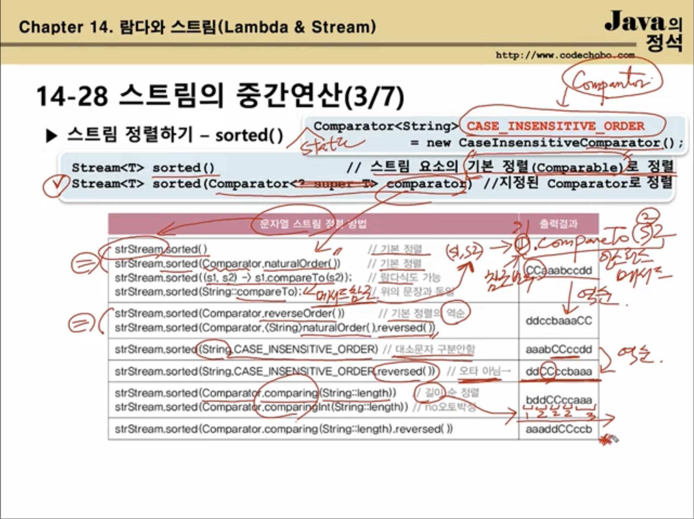
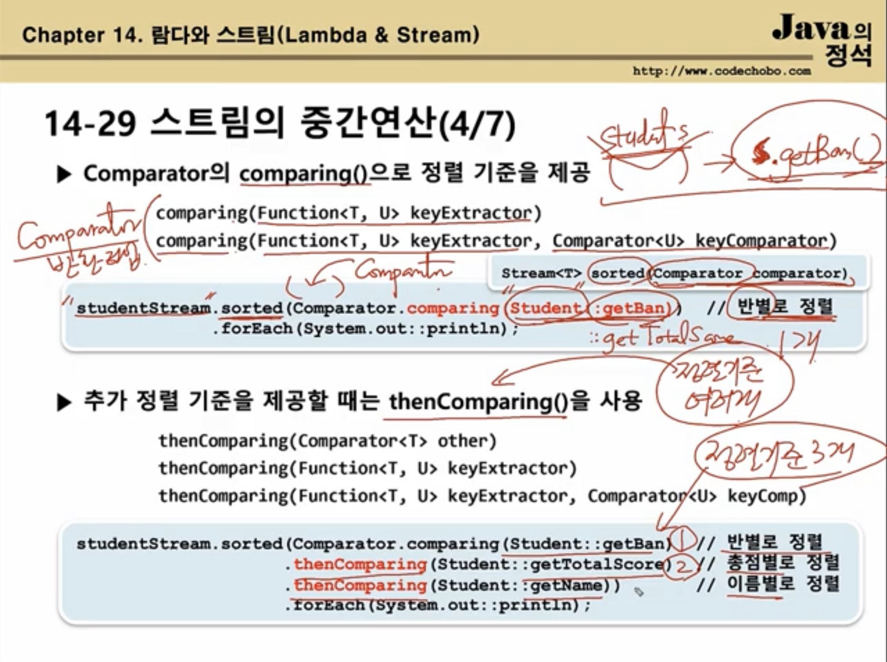

## 14-28 스트림의 중간연산(3/7)

- 스트림 정렬하기 - sorted( )

  ```java
  Stream<T> sorted();												// 스트림 요소의 기본 정렬(Comparable) 로 정렬
  Stream<T> sorted(Comparator<? super T> comparator);		// 지정된 Comparator 로 정렬
  ```

  원래 정렬 할 때 필요한 건 2 가지가 있다.

  1. 정렬 대상
  2. 정렬 기준

  그래서 위의 comparator 를 줘야 하는 데, 만약 안 주면 

  stream 요소가 구현한 comparable 로 정렬을 시행함

  

  

## 14-29 스트림의 중간연산(4/7)




## 14-30 스트림의 중간연산(5/7)

이 전까지 배운 중간연산들은 다음과 같다.

skip(),  limit(), distinct(), filter(), sorted() 이 3가지이다!


앞으로 배울 것은 

`map() : stream 요소 변환`

`peek() : forEach() 와 비슷함`

`flatmap() : 차원을 변환해준다? 이게 ㅅㅂ 뭔소리야`


- 스트림의 요소 변환하기 - map()

  ```java
  Stream<R> map(Function<? super T, ? extends R> mapper); // Stream<T> -> Stream<R>
  ```

  ```java
  Stream<File> fileStream = Steram.of(new File("Ex1.java"), new File("Ex1"), new File("Ex1.bak"), new File("Ex2.java"), new File("Ex1.txt"));
  
  Stream<String> filenameStream = fileStream.map(File::getName);
  // 아님
  Stream<String> filenameStream = fileStream.map((File f) -> f.getName());
  filenameStream.forEach(System.out::println);
  ```


- Ex) 파일 스트림(Stream<File> ) 에서 파일 확장자(대문자)를 중복없이 뽑아내기 

  ```java
  fileStream.map(File::getName)
    .filter(s->s.indexOf('.')!=-1)
    .map(s->s.subString(s.indexOf('.')+1))
    .map(String::toUpperCase)
    .distinct()
    .forEach(System.out::println);		
  //JAVA
  //BAK
  //TXT
  ```


- 참조) Ex14_6


## 14-32 스트림의 중간연산(6/7)

- 스트림의 요소를 소비하지 않고 엿보기 - peek( )

  ```java
  Stream<T> peek(Consumer<? super T> action);		  //중간연산(스트림을 소비 x)
  void			forEach(Consumer<? super T> action);	//최조 연산(스트림 요소를 한 개씩 소비 o)
  ```

  주로 디버깅 용도로 많이 사용한다!

  ```java
  fileStream.map(File::getName)		// Stream<File> -> Stream<String>
    .filter(s->s.contains('.'))
    .peek(s->System.out.printf("filename = %s%n", s))
    .map(s->s.subString(s.indexOf('.')+1))
    .peek(s->s.System.out.printf("extension = %s%n", s))
    .forEach(System.out::println);
  ```


- 참조) Ex14_6

  

## 14-33 스트림의 중간연산(7/7)


tlqkf 뭔 소리야

- map 이나 filter 같은 거 쓰면, 리턴값이 Stream 이기 때문에,

  잘못하면 Stream<Stream<String>> 같은 꼬라지가 나온다.

- 참조) Ex14_7