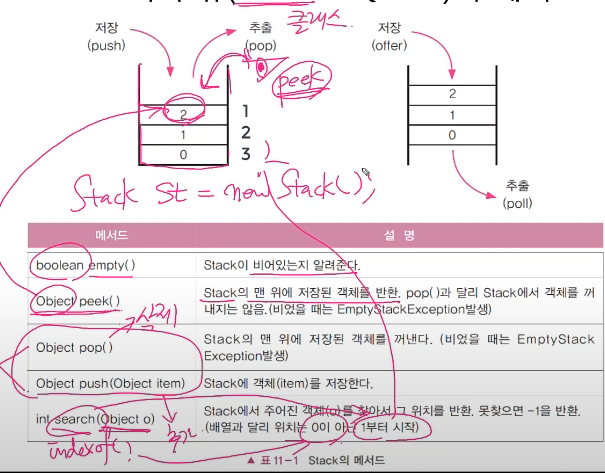

## **11단원은 여러번, 반복 빠르게 전체적으로 해야됨**

## **목차만이라도 한번 써보고 하기!**


# 11-1 컬렉션 프레임웍(collections framework)

- **컬렉션(collection)**

  : **여러 객체(데이터)를 모아 놓은 것을 의미**

  

- **프레임웍(framework)**

  **: 표준화, 정형화된 체계적인 프로그래밍 방식**

  

  라이브러리(Library) 는 프레임웍 과는 다르게, **기능** 만을 제공한다.

  

  **프레임웍은 기능 에다가 어떠어떠한 식으로 프로그래밍을 해라!** 

  자유도가 떨어질 수도 있지만, 어떻게 보면 정해진 대로 하면 되니까 

  1. 프로그래밍의 생산성이 올라가게 된다

  2. 유지보수가 편해진다 

  Spring Framework 도 그 예시중 하나이다

  

- **컬렉션 프레임웍(collections framework)**

  **: 컬렉션(=다수의 객체) 를 다루기 위한 표준화된 프로그래밍 방식**

  

  **컬렉션을 쉽고 편리하게 다룰 수 있는 다양한 클래스를 제공** 

  여기서 컬렉션, 즉 다수의 객체를 다룬다 == 객체를 저장, 삭제, 검색, 정렬

  

  객체는 사실, 다수의 데이터라고 보면 된다. 

  이 다수의 데이터를 효율적으로 하는 거임

  **java.util 패키지에 포함되어 있음. JDK1.2 부터 제공함**

  다만 1.2 때는 표준화가 되어 있지 않았다. 그래서 이를 정리하고 표준화 한게 컬렉션 프레임웍이다.

  

- **컬렉션 클래스**

  **: 다수의 데이터를 저장(+ 삭제, 검색, 정렬)할 수 있는 클래스 ex) Vector, ArrayList, HashSet**

# 11-2 컬렉션 프레임웍의 핵심 인터페이스

컬렉션이란 다수의 객체, 다수의 data 이다.
근데 이 다수의 data 를 크게 3 가지로 나누어 보니 List, Set, Map 이고 이를 인터페이스로 구현해둠.

| 인터페이스 | 특징                                                         | 구현클래스                              | 정리                                                |
| ---------- | ------------------------------------------------------------ | --------------------------------------- | --------------------------------------------------- |
| List       | **순서(저장하는 순서)**가 있는 데이터의 집합. 데이터의 **중복을 허용**한다 | ArrayList, LinkedList, Stack, Vector    | 순서 : o<br />중복 : o                              |
| Set(집합)  | **순서를 유지하지 않는** 데이터의 집합. 데이터의 **중복을 허용하지 않는다**.<br />네발 동물 : {개, 고양이, 사자, 코끼리, 호랑이, ~~개~~} | HashSet, TreeSet                        | 순서 : x<br />중복 : x                              |
| Map        | 키(key) 와 값(value) 의 쌍(pair) 으로 이루어진 데이터의 집합.<br />**순서는 유지되지 않**으며, **키는 중복을 허용하지 않**고, **값은 중복을 허용**한다<br />예) 우편번호, 지역번호(전화번호)<br />02  : 서울<br />031 : 경기 | HashMap, TreeMap, Hashtable, Properties | 순서 : x<br />key 값: 중복 x<br />value 값 : 중복 o |

그리고 **List, Set 의 공통 부분을 뽑아내** 이를 **Collection 이라는 인터페이스**를 저장했다!

# 11-3 Collection 인터페이스의 메서드


이것들을 지금당장 하나하나 볼 필요는 없다고 하심.

추가, 검색, 삭제 의 기능을 하는 메서드들이 있다고 생각하면 된다

# 11-4 List 인터페이스 - 저장순서 0, 중복 o


- List 아래에는 Vector, ArrayList, LinkedList 3가지가 있다.

  이중 Vector 는 오래됐고, 이를 개선한 게 ArrayList 이다

- 우리는 이중 ArrayList, LinkedList 이 2 가지만 알면 된다.


- 여기도 Collection 메서드와 같이 **추가, 검색, 삭제** 가 있고, 
- 추가로 읽기(get), 변경(set), 그리고 정렬(sort) 가 있다.
- ListIterator 는 나중에 따로 설명해준다고 하심

# 11-5 Set 인터페이스 - 순서 x, 중복 x


- Set 의 상속계층도는 위와 같다. 

  우리는 이중 **HashSet, TreeSet** 이 두 가지만 알면 된다

  


- Set 메서드는 Collection 과 동일하다

  


- 위의 표에 있는 메서드들은 **합집합, 부분집합, 차집합, 교집합** 등의 연산시에 사용하는 메서드들이다!

  만약 우리가 집합의 연산을 사용해야 한다면, HashSet, TreeSet 을 사용하는 게 가장 유용하다!

# 11-6 Map 인터페이스 - 순서x, 중복(키x, 값o)


- Map 에선 **HashMap, TreeMap** 만 알면 된다.
- Hashtable (옛날, 동기화 o) -- 개선 --> HashMap (최신, 동기화 x)
- LinkedHashMap 은 Map 이지만, 순서가 존재한다. 그래서 Map 이지만 순서가 필요하면 LinkedHashMap 을 사용하면 된다!


- 여기선 삽입하는 메서드가 **put(Object key, Object value)** 이렇게  (key, value) 같이 넣음
- (Key, Value) : Entry
- Key 의 집합 : KeySet --> Key 는 중복 허용x 라서, **Set entrySet(), Set keySet()** 의 return 타입이 Set 인거다!!!
- Value 의 집합 : Values --> 얘는 중복 허용이다보니, **Collection values()** 의 return 타입이 Collection, 즉 중복이여도 아니여도 상관이 없다고 하는 것.

# 11-7 ArrayList

- **ArrayList 는 기존의 Vector 를 개선한 것으로, 구현원리와 기능적으로 동일**
- **ArrayList 와 달리, Vector 는 자체적으로 동기화처리가 되어 있다.**
- **List 인터페이스를 구현하므로, 저장 순서가 유지되고, 중복을 허용한다**
- **데이터의 저장공간으로 배열을 사용한다.(배열기반) --> ?**

```java
public class Vector extends AbstractList implements List, RandomAccess, Cloneable, java.io.Serializable {
    //~
    protected Object[] elementData; // 객체를 담기 위한 배열, 모든 종류의 객체 저장 가능
}
```

# 11-8 ArrayList의 메서드

### 생성자

| ArrayList()                        | 기본 생성자                                                  |
| ---------------------------------- | :----------------------------------------------------------- |
| **ArrayList(Collection c)**        | 기존의 Collection 을 ArrayList 로 만들때 사용<br />**Collection c 니까, 매개변수로 list1.subList(1,4) 같은 것도 들어와도 된다!** |
| **ArrayList(int initialCapacity)** | 배열은 한번 길이를 정하면 길이를 늘릴 수가 없다. <br />그래서 ArrayList 를 만들 때 내가 저장하려고 하는 객체의 갯수만큼 배열의 길이를 넉넉하게 지정해줘야 한다. |

### 

### 메서드(추가)

| boolean add(Object o)                       | Object o 를 저장, 저장 여부에 따라 true/false return     |
| ------------------------------------------- | -------------------------------------------------------- |
| **void add(int index, Object element)**     | 지정 위치 index 에 Object element 를 저장함              |
| **boolean addAll(Collection c)**            | Collection c 에 있는 모든 객체를 저장                    |
| **boolean addAll(int index, Collection c)** | 지정 위치 index 에 Collection c 에 있는 모든 객체를 저장 |


### 메서드(삭제)

| boolean remove(Object O)            | add 랑 같음                                        |
| ----------------------------------- | -------------------------------------------------- |
| **Object remove(int index)**        | 특정 위치 index 에 있는 객체 삭제                  |
| **boolean removeAll(Collection c)** | Collection c 에 있는 객체와 일치하는 것들을 삭제함 |
| **void clear()**                    | 모든 객체 삭제                                     |


### 메서드(검색)

| int indexOf(Object o)                     | 찾으면 인덱스, 못 찾으면 -1 return                           |
| ----------------------------------------- | ------------------------------------------------------------ |
| **int lastIndexOf(Object o)**             | 보통 왼쪽에서부터 시작해서 찾음<br />하지만 얘는 오른쪽(끝) 에서부터 찾아감 |
| **boolean contains(Object o)**            | Object o 를 찾으면 true, 아니면 false                        |
| **Object get(int index)**                 | 지정 위치 index 에 해당하는 Object return                    |
| **Object set(int index, Object element)** | 지정 위치 index 에 해당하는 곳을 주어진 Object element 로 변환함 |


| **List subList(int fromIndex, int toIndex)** | **fromIndex <= x < toIndex 에 해당하는 객체들로 새로운 List 만듬** |
| -------------------------------------------- | ------------------------------------------------------------ |
| **Object[ ] toArray()**                      | **ArrayList의 객체 배열을 반환**                             |
| **Object[ ] toArray(Object[] a)**            |                                                              |
| **boolean isEmpty()**                        | 비어 있는지 확인                                             |
| **void trimToSize()**                        | 빈공간 제거                                                  |
| **int Size()**                               | 저장된 객체의 갯수 return                                    |

 참조) Ex11_1, 여기에 정리한 것 외에 다른 메서드들도 나온다

# 11-10 ArrayList에 저장된 객체의 삭제과정

- ArrayList에 저장된 세 번째 데이터(data[2])를 삭제하는 과정. 

  **list.remove(2); 를 호출**


- 이건 실제로 써보면서 해보는 게 좋다.
- 이처럼 일어나기 때문에, remove(int index) 를 사용할 때는 마지막 인덱스부터 하는 거다!

# 11-12  **배열**의 장단점

- 장점 : **배열은 구조가 간단하고, 데이터를 읽는 데 걸리는 시간(접근시간, access time) 이 짧다!**

  ```java
  int[] arr = {1,2,3,4,5};
  ```

  이때 arr 의 주소가 0x100 이라고 하면, int 는 4 byte 이기 때문에

  n 번째 객체는 0x100 + n * 4(byte) 를 하면 바로 구할 수 있다.

  이게 바로 구조가 간단하다는 의미이다.

  

- 단점 1 : **크기를 변경할 수 없다.**

  - 크기를 변경해야 하는 경우  

  1. 새로운 배열을 생성 후 (new Array())
  2. 데이터를 복사해야함 (System.arraycopy)

  3. 참조변경

     이러한 일련의 과정을 거쳐야 한다. 

     **그리고 이 과정들은 꼭 외워야 한다**

  - **크기 변경을 피하기 위해 충분히 큰 배열을 생성하면, 메모리가 낭비됨**.

    

- 단점 2 : **비순차적인(중간에) 데이터의 추가, 삭제에 시간이 많이 걸린다.**
  - 데이터를 추가하거나 삭제하기 위해, 다른 데이터를 옮겨야 함
  
  - 그러나 순차적인 데이터 추가(끝에 추가) 와 삭제(끝부터 삭제)는 빠르다.
  
    -> 왜냐하면, 끝에서부터 순처적으로 지우면, 데이터를 옮기는 작업이 필요하지 않아서이다
  
  - 그래서 처음에 저장하려는 배열의 크기를 잘 생각해, 크기를 지정해야 한다.

# 11-12 LinkedList - 배열의 단점을 보완

**배열의 단점**

1. 크기 변경 x
2. 추가/삭제 시간 ↑

**LinkedList 가 배열의 단점을 보완하는 법**

- 배열과 달리 Linked List는 불연속적으로 존재하는 데이터를 연결(link)

  

- **데이터의 삭제** : 단 한 번의 참조변경만으로 가능

- **데이터의 추가** : 한번의 Node 객체 생성과 두 번의 참조변경 만으로 가능

  

  LinkedList 는 { 다음 노드의 주소, 데이터 } 로 이루어져 있음. 

  

  그래서 삭제/추가 시 그 전/후의 노드의 다음 노드의 주소, 

  즉 참조 변수가 다른 노드를 가르키게 하기만 하면 된다.

  

**LinkedList 의 단점**

- **Linked List - 연결 리스트. 데이터 접근성이 나쁨**

  배열은 연속적이기 때문에, 1번째에서 n 번째 가는 게 쉽다

  하지만 LinkedList 는 1 번째에서 n번째 가려면 (n-1) 번이나 움직여야 한다.

  

  

- **Doubly Linked List - 이중 연결리스트, 접근성 향상**

  Linked List 는 0 번째에서 n 번째로밖에 갈 수가 없다.

  그래서 얘는 Node 클래스 안에 `Node next, Node previous` 이 2 가지를 다 가지고 있다.

  

  

- **Doubly circular Linked List - 이중 원형 연결리스트**

  보통 자바는 이중 연결리스트로 구현됨.

  

  예전에 했던 TV 클래스 예제에서, Ch1 ~ 999 가 있을 때

  999에서 ch++ 하면 1 로 바뀌는 걸 생각하면 쉽다.

# ArrayList vs LinkedList - 성능 비교

- ArrayList 는 배열 기반, LinkedList 는 연결 기반

  Data Structure!

  

# 11-15 스택과 큐(Stack & Queue)

- **스택 (Stack) : LIFO 구조. 마지막에 저장된 것을 제일 먼저 꺼내게 된다.**

  

  위에만 뚫린 상자

  Last In First Out 의 구조를 가지고 있다.

  만약 1, 2, 3, 4, 5 를 5, 4, 3, 2, 1 로 출력하고 싶다면

  Stack 에다가 집어 넣으면 된다

  push 로 저장, pop 으로 추출

  

  Push, Pop 예전에 자바스크립트에서 보던 거다!

  

- **Queue : FIFO 구조. 제일 먼저 저장한 것을 먼저 꺼내게 된다.**

  

  양끝이 뚫린 상자!

  0, 1, 2 넣으면 0, 1, 2 가 나오게 된다.

  offer 로 저장, poll 로 추출

  

- **그렇다면 Stack 과 Queue 는 무엇으로 구현하는 게 더 유리할까?**

  **Stack - 배열**

  배열은 중간의 요소를 추가/삭제 시, 복사하고 옮기고, 마지막 요소 다시 지우기 라는 일련의 과정을 거쳐야 한다. 

  하지만 마지막 요소는 추가/삭제 시 일련의 과정 없이 바로 추가/삭제가 된다.

  이는 Stack LIFO 구조와 잘 맞기 때문에, 배열이 유리하다고 볼 수 있다.

  

  **Queue - Linked List**

  Queue 는 FIFO 의 구조를 가지고 있다. 

  추가/삭제 시에 일련의 과정을 거쳐야 하는 배열은 이 경우에 매우 비효율적이다

  하지만 Linked List 는 노드간의 연결을 맺거나 끊는 거 만으로 바로 구현이 가능하다

  따라서 Linked List 가 더 유리하다

# 11-16 스택과 큐(Stack & Queue) 의 메서드

- **Stack 의 메서드**

  

메서드들은 보면 이해가 갈 것이다. 추가로 설명 붙일만한 거는

Object peek() - pop() 과는 다르게 실제로 객체를 꺼내지 않는다

int search(Object o) - indexOf() 메서드와 같다. 다만, indexOf 는 0 부터 시작하지만 얘는 1부터 시작함.
그림에서와 같이, 위에서부터 `1, 2, 3, ~` 순으로 index 가 붙게 된다


- **Queue 의 메서드**

  

  **예외 발생 메서드**

  1. boolean add(Object o)

  2. Object remove()

  3. Obejct element()

     

  **예외발생 x 메서드**

  1. boolean offer(Object o) - 추가
  2. Obejct poll() - 삭제
  3. Object peek() - 삭제 안하면서 보기

  

- Stack 은 클래스 / Queue 는 인터페이스다.

  그래서 new Stack() 은 가능해도, new Queue() 는 안된다. 인터페이스라 객체 생성이 안된다!

  그러면 어떻게 객체로 다뤄야 하냐? 에 대해 11-18에서 배우게 된다.

# 11-18 인퍼페이스를 구현한 클래스 찾기

인터페이스은 Queue 를 사용하려면 어떻게 해야 하느냐?

1. Queue 를 직접구현
2. **Queue 를 구현한 클래스를 사용** - 이번 단원에서는 이 방법을 알려준다.

- Java API Document 에서 Queue interface 를 보게 되면

  `All Known Implementing Classes` 가 나오게 된다.

  

  

  그래서 Queue 를 사용하는 방법은 다음과 같다.

  ```java
  // 방법 1
  Queue q = new LinkedList();
  
  // 방법 2
  LinkedList q = new LinkedList();
  ```

  방법 1 과 방법 2 는 작동을 하는 데 있어서 차이가 없다.

  하지만 나중에 new LinkedList() 대신에 new ArrayDeque() 가 들어온다고 했을 때

  참조변수의 타입이 Queue 면 코드를 변경할 일이 없지만 (방법 1),

  참조변수의 타입이 LinkedList 면 코드를 일일히 다 변경해야 할지도 모른다. (방법 2)

  

- 참조) Ex11_2

# 11-19 Stack&Queue 의 활용

- **Stack의 활용 예**

  

  다양한 예시들이 있는 데, 그 중 제일 와 닿는 것은 브라우저의 뒤로 가기/앞으로 가기 이다. 

  예시에서는 브라우저가 Stack 이 2 개가 있는 걸로 설명을 해줌. 

  

  하지만 실제로는 Stack 1개와 Pointer 를 가지고 있다.		

  

- **Queue 의 활용 예**

  

  최근 사용문서의 예시가 가장 와닿음.

  오른쪽 위에 그림을 보면 다시 생각이 잘 날것이다.

  

- 참조 ) Ex11_3

# 11-22 Iterator, ListIterator, Enumeration

- **컬렉션에 저장된 데이터를 접근(읽어오기)하는 데 사용되는 인터페이스**

  

  **Iterator Interface 의 메서드**

  boolean hasNext() - 남아있는 요소 확인

  Object next() - 다음 요소를 읽어오기

- **Enumeration 은 Iterator의 구버전**

  

  **Enumeration Interface 의 메서드**

  배우는 이유는 아직도 자바 코드 중에 Enumeration 을 쓰는 코드가 있기 때문이다

  나중에 만약 Enumeration 을 보게 된다면, Iterator 와 사용법이 같으니 걱정 안해도 된다.

  

- **ListIterator 는 Iterator 의 접근성을 향상시킨 것 (단방향 -> 양방향)**

  Iterator 메서드들 + previous() 라는 메서드만 추가된 것이다. 

  근데 ListIterator 는 잘 쓰지 않으니, Iterator 만 사용 하면 됨.

  

- **컬렉션에 저장된 요소들을 읽어오는 방법을 표준화 한 것**

  Collection 에는 크게 3 가지가 있다.

  > List, Set, Map

  이 3 가지는 각기 다른 자료 구조를 가지고 있기 때문에, 

  **요소에 접근(읽어오기)하는 방법도 다르다**

  

  그 예시로 만약 LinkedList() 였다가 TreeSet() 으로 바꾸게 되는 경우가 있다고 해보자

  그렇게 되면 자료 구조가 바뀌기 때문에 아얘 코드를 바꿔버려야 한다.

  그래서 이런 상황을 방지하기 위해, 접근하는 방법을 표준화 시킨 것이다.

  

- **컬렉션에 iterator() 를 호출해서 Iterator를 구현한 객체를 얻어서 사용**

  iterator() 함수는 Collection 클래스에 내장된 메서드이기 때문에, List Set 클래스 둘다 사용이 가능!

  ```java
  public interface Collection {
      //~
      public Iterator iterator();
      //~
  }
  ```

  

  iterator() 사용하는 예시

  ```java
  List list = new ArrayList();
  Iterator it = list.iterator();
  
  while(it.hasNext()){	// 읽어올 요소가 있는 지 확인
      System.out.println(it.next());	// 있으면 요소를 읽어옴
  }
  ```

  

- 참조) Ex11_5

  ```java
  Collection list = new ArrayList();	// 다형성을 이용해 코드를 유연하게 짜는 이 부분 되게 중요하다!!!
  list.add(1);
  list.add(2);
  list.add(3);
  list.add(4);
  list.add(5);
  
  Iterator it = list.iterator();
  
  while(it.hasNext()){
      Object obj = it.next();
      System.out.println(obj);
  }
  
  // it = list.iterator(); - 1
  
  for(int i = 0 ; i < list.size() ; i++){
      Object obj = list.get(i);
      System.out.println(obj);	// 이러면 아무 것도 안 나온다.
  }
  ```

  Iterator 는 Collection 안을 가르키게 된다. 

  이미 위의 while 문에서 Iterator it 는 5 그 다음을 가르키고 있어서 안 나온다. 

  그래서 한번 더 출력하고 싶으면 주석처리된 1 처럼

  다시 한번 iterator() 함수를 사용해야 한다.

# 11-24 Map 과 Iterator

- **Map 에는 iterator() 가 없다. keySet(), entrySet(), values()를 호출해야 한다!**

  ```java
  public interface Collection {
      //~
      public Iterator iterator();
      //~
  }
  ```

  List 와 Set 은 Collection 의 자손이니까 iterator( ) 를 사용할 수 있다.

  

  하지만 Map는 자손이 아니기 때문에 iterator() 대신에 다르게 사용해야 한다.

  그래서 Set 를 반환하는 keySet(), entrySet(), values() 를 사용한 후, iterator() 를 호출함.

  ```java
  Map map = new HashMap();
  //~
  Iterator it = map.entrySet().iterator();
  ```

# 11-25 Arrays(1/4) 

- **배열을 다루기 편리한 메서드(static) 제공하는 클래스**

  비슷한 걸로는 Objects, Collections, Math 클래스가 있다!

  

1. 배열의 출력 - toString();

   ```java
   static String toString(boolean[] a)	// "[true, false, true, true, false]"
   ```

   

2. 배열의 복사 - copyOf(), copyOfRange()

   ```java
   int[] arr = {0,1,2,3,4};
   int[] arr2 = Arrays.copyOf(arr,arr.length);	// arr2 = [0,1,2,3,4]
   int[] arr3 = Arrays.copyOf(arr,3);	// arr3 = [0,1,2]
   int[] arr4 = Arrays.copyOf(arr,7);	// arr4 = [0,1,2,3,4,0,0]
   int[] arr5 = Arrays.copyOfRange(arr,2,4);	// arr5 = [2,3]
   int[] arr6 = Arrays.copyOfRange(arr,0,7);	// arr6 = [0,1,2,3,4,0,0]
   ```

   copyOf() 와 copyOfRange() 는 새로운 배열을 만들어서 return 함

   

3. 배열 채우기 - fill(), setAll();

   ```java
   int[] arr = new int[5];
   Arrays.fill(arr,9);	// arr = [9,9,9,9,9]
   Arrays.setAll(arr, (i) -> (int)(Math.random()*5) + 1);	// arr = []
   ```

   

4. 배열의 정렬과 검색 - sort() - 정렬, binarySearch() - 검색

   ```java
   int[] arr = {3, 2, 0, 1, 4};
   int idx = Arrays.binarySearch(arr, 2);	// idx = -5 (잘못된 결과)
   									// 이진탐색은 정렬되어 있을 때만 binarySearch 가 된다.
   Arrays.sort(arr);
   System.out.println(Arrays.toString(arr));	// [0,1,2,3,4]
   int idx = Arrays.binarySearch(arr, 2);		// idx = 2
   ```

   

## 알아두면 좋다! - 순차 검색과  이진 검색

---

- 순차검색

|  7   |  1   |  6   |  9   |  5   |  3   |  8   |  4   |  10  |  2   |
| :--: | :--: | :--: | :--: | :--: | :--: | :--: | :--: | :--: | :--: |

	- 정렬이 되어 있지 않음
	- 1 ~ 10 을 찾는 데 평균적으로 5.5회가 걸린다.


- 이진검색

| 1    | 2    | 3    | 4    | 5    | 6    | 7    | 8    | 9    | 10   |
| ---- | ---- | ---- | ---- | ---- | ---- | ---- | ---- | ---- | ---- |

- 저번 학기에 배웠던 이진트리를 생각하면된다

- 위에서부터  ( x<5 , 5<x) 로 한번 분기

  (x<8, 8<x) 로 한번 분기

- 이런식으로 하면 평균 3~4번 정도 나오게 된다

# 11-27 Arrays(3/4)

5. 다차원 배열의 출력 - deepToString()

   ```java
   int[] arr = {0,1,2,3,4};
   int[][] arr2D = {{11,22}, {21,22}};
   
   System.out.println(Arrays.toString(arr));	// [0,1,2,3,4]
   System.out.println(Arrays.deepToStrin(arr2D));	// [[11,22], [21,22]]
   ```

   

6. 다차원 배열의 비교 - deepEquals()

   ```java
   String[][] str2D = new String[][]{{"aaa","bbb"}, {"AAA","BBB"}};
   String[][] str2D2 = new String[][]{{"aaa","bbb"}, {"AAA","BBB"}};
   
   System.out.println(Arrays.equals(str2D, str2D2));	// false
   System.out.println(Arrays.deepEquals(str2D, str2D2));	// true
   ```

   

7. 배열을 List 로 변환 - asList(Object... a)

   ```java
   List list = Arrays.asList(new Integer[]{1,2,3,4,5}); // list = [1,2,3,4,5]
   List list = Arrays.asList(1,2,3,4,5);
   list.add(6);	// UnsupportedOperationException 예외 발생. 왜냐하면 asList 가 return 한 list 는 읽기 전용이기 때문.
   
   // 따라서 list 를 조작하고 싶으면 다음과 같이 해야 한다.
   List list = new ArrayList(Arrays.asList(1,2,3,4,5));	// 새로운 ArrayList!
   ```

   

8. 람다와 스트림(14장) 관련 - parallelXXX(), spliterator(), stream()

   이건 14장에서 설명한다고 하심

- 참조) Ex11_6

