# 12-1 지네릭스(Generics) 란?

- 컴파일시 타입을 체크해 주는 기능(compile-time type check) - JDK 1.5 부터!

  ```java
  // Tv 객체만 저장할 수 있는 ArrayList 를 생성
  ArrayList<Tv> tvList = new ArrayList<Tv>();
  
  tvList.add(new Tv());	//ok
  tvList.add(new Audio());	// compile error. Tv 외에 다른 타입은 저장 x
  ```

  ```java
  public class GenericTest {
      public static void main(String[] args) {
          ArrayList<Integer> list = new ArrayList<Integer>();
  //        ArrayList<Object> list = new ArrayList<Obejct>(); 다양하게 들어올 수 있게 하는 코드는 이거이다.
  //        사실 ArrayList list = new ArrayList() 이렇게 해도 되는 데, 좋은 코드가 아니라서, 꼭 지네릭스를 붙여주도록 하자!
  // 		  클래스 안에 Object 타입이 있은 것들은 일반 클래스에서, 지네릭 클래스로 바뀜
          list.add(10);
          list.add(20);
  //        list.add("30");
  
  //        Integer i = list.get(0); get() 은 Object 를 반환함. 그리고 설명 보면
  //        get() 의 반환타입은 ArrayList 의 지네릭스 타입을 반환한다고 되어 있음
  
  
          System.out.println("list = " + list);
      }
  }
  ```

  참조) GenericTest

- 객체의 타입 안정성(ClassCastException 방지)을 높이고, 형변환의 번거로움을 줄여줌

  ```java
  // Generics 사용전
  ArrayList tvList = new ArrayList();
  tvList.add(new Tv());
  Tv t = (Tv)(tvList.get(0));
  
  // Generics 사용 후
  ArrayList<Tv> tvList = new ArrayList<Tv>();
  tvList.add(new Tv());
  Tv t = tvList.get(0);
  ```

- 지네릭스의 장점

  1. 타입 안정성을 제공한다

     : ClassCastException 을 막을 수 있음!

  2. 타입체크와 형변환을 생략할 수 있으므로, 코드가 간결해진다.

     : 형변환을 안써도 되니까, 간결해진다는 의미임.

     

- 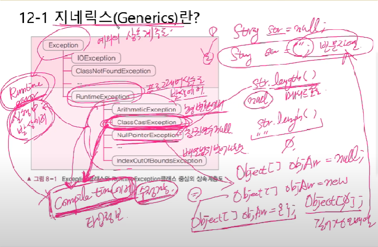

  ClassCastException 은 RuntimeException 중 하나이다. 

  근데 RuntimeException 이 발생하면, 프로그램이 죽어버리게 된다. 이는 겪어봐서 알듯이 없으면 없을 수록 더 좋다.

  그래서 RuntimeException 을 Compile time 때로 옮겨오도록 하는 노력을 한다.

  지네릭스는 이 RuntimeException 중 ClassCastException 을 Compile time 때 발생하도록 하는 것이다!

# 12-2 타입 변수

- 지네릭 클래스를 작성할 때, Object 타입 대신 타입 변수(E) 를 선언해서 사용한다.

  ```java
  public class ArrayList extends AbstarctList{ // 이처럼 Object 를 포함한 클래스를
      private transient Object[] elementData;
      public boolean add(Object o) {/*~*/}
      public Object get(int index) {/*~*/}
      // ~
  }
  
  public class ArrayList<E> extends AbstractList{ // 지네릭 클래스로 바꾼다.
      private transident E[] elementData;
      public boolean add(E o) {/*~*/}
      public E get(int index) {/*~*/}
  }
  ```

  위의 예시에서는 타입 변수를 E 로 선언해서 모든 Object 대신 넣어줬지만, 

  EE, X, Y, T 아무 문자나 써도 상관없다.

  다만 지정했다면, 모든 Object 는 지정한 타입 변수로 바꿔주는 걸 조심하기!

# 12-3 타입 변수에 대입하기

- 객체를 생성시, 타입 변수(E) 대신 실제 타입(Tv) 을 지정(==대입한다 와 같은 의미)

  ```java
  ArrayList<Tv> tvList = new ArrayList<Tv>();
  ```

  타입 변수 E 에다가 Tv 를 대입하는 것이다.

  지네릭스는 참조변수의 타입, 생성자 뒤에 써야하고

  무조건 같은 타입을 넣어야 한다!!! 

  다형성이고 뭐고 없다 여긴

  ```java
  public class ArrayList<E> extends AbstractList{ // 이 코드를
      private transident E[] elementData;
      public boolean add(E o) {/*~*/}
      public E get(int index) {/*~*/}
  }
  
  public class ArrayList<Tv> extends AbstractList{ // 이렇게 바꿨다.
      private transident E[] elementData;
      public boolean add(Tv o) {/*~*/}
      public Tv get(int index) {/*~*/}
  }
  ```

- 타입 변수 대신 실제 타입이 지정되면, 형변환 생략가능

  ```java
  // Generics 사용전
  ArrayList tvList = new ArrayList();
  tvList.add(new Tv());
  Tv t = (Tv)(tvList.get(0));	// get() 의 return 타입이 Object 라 casting 필수임.
  
  // Generics 사용 후
  ArrayList<Tv> tvList = new ArrayList<Tv>();
  tvList.add(new Tv());
  Tv t = tvList.get(0);	// 형변환 불필요함.
  ```

- 참조) GenericTest2

# 12-4 지네릭스 용어

> Box<T> :  지네릭 클래스. 'T의 Box' 또는 'T Box' 라고 읽는다.
> T		   : 타입 변수 또는 타입 매개변수. (T 는 타입 문자)
> Box	   : 원시 타입(raw type) -> 일반 클래스랑 같은 의미임

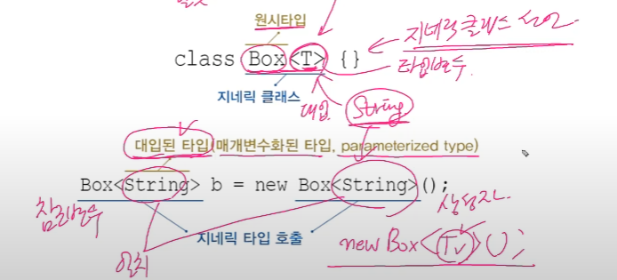

​	위 그림에서, ` 타입 변수에 String이 대입되었다` 라고 표현함!

# 12-5 지네릭 타입과 다형성

- 참조 변수와 생성자의 대입된 타입은 일치해야 한다

  ```java
  class Product{}
  class Tv extends Product{}
  class Audio extends Product{}
  
  ArrayList<Tv>		list = new ArrayList<Tv>();		//ok
  ArrayList<Product>	 list = new ArrayList<Tv>();	// error.
  ```

- 지네릭 클래스간의 다형성은 성립. (하지만 여전히 대입된 타입은 일치해야 함!!)

  ```java
  List<Tv> list = new ArrayList<Tv>();	//ok. 다형성. ArrayList 가 List 구현했음
  List<Tv> list = new LinkedList<Tv>();	//ok. 다형성. LinkedList 가 List 구현했음
  ```

- 매개변수의 다형성도 성립

  ```java
  ArrayList<Product> list = new ArrayList<Product>();
  list.add(new Product());
  list.add(new Tv());		// ok
  list.add(new Audio());	// ok
  ```

  사실 이건 안되는 게 이상하긴 하지만, 이것에 대한 설명은 다음 코드 박스를 보자

  ```java
  // 원래 ArrayList 의 add 메서드
  boolean add(E e){/**/} 
  
  // 하지만 지네릭스에 Product 를 넣음 == E(타입 변수)에 Product 를 대입했다.
  boolean add(Product e){/**/}
  ```

  

- 참조) Ex11_2

  ```java
  // 의외였던거
  public class Ex12_1 {
      public static void main(String[] args) {
          ArrayList<Product2> productList = new ArrayList<Product2>();
          ArrayList<Tv2>       tvList = new ArrayList<Tv2>();
  //        ArrayList<Product2> tvList = new ArrayList<Tv2>();
  //        List<Tv2> tvList = new ArrayList<Tv2>();
  
          productList.add(new Product2());
          productList.add(new Tv2());
          productList.add(new Audio2());
  
          tvList.add(new Tv2());
  //        tvList.add(new Product2());
  
          printAll(productList);
  //        printAll(tvList); 선언된 부분이 매개변수로 ArrayList<Product2> list 를 받기 때문에, 여기서는 new ArrayList<Tv2>() 를 받을 수 없다!
      }	// end of main
  
      public static void printAll(ArrayList<Product2> list){
          for(Product2 p : list){
              System.out.println(p);
          }
      }
  }
  ```

# 12-7 Iterator<E>

- 클래스를 작성할 때, Object 타입 대신 T와 같은 타입 변수를 사용

  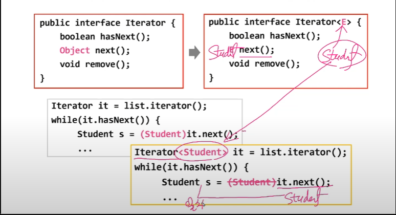

  참조) Ex12_2

# 12-8 HashMap <K,V>

- 여러 개의 타입 변수가 필요한 경우, 콤마(,) 를 구분자로 선언

  ```java
  // 사용 예시
  HashMap<String, Student> map = new HashMap<String, Student>();
  map.put("자바왕", new Student("자바왕", 1,1,100,100,100));
  
  // HashMap 내부 코드
  public class HashMap<K,V> extends AbstractMap<K,V>{
      public V get(Object key){/*내용생략*/}
      public V put(K key, V value){/*내용생략*/}
      public V remove(Object key){/*내용생략*/}
      //~
  }
  
  // 사용면에서의 차이점
  Student s1 = (Student)map.get("1-1");
  Student s1 = map.get("1-1");
  ```

  참조)12_2_2

# 12-9 제한된 지네릭 클래스

- extends 로 타입 변수에 대입할 수 있는 타입을 제한

  ```java
  class FruitBox<T extends Fruit>{	// Fruit 의 자손만 대입 가능하다 라는 뜻
      ArrayList<T> list = new ArrayList<T>();
      //~
  }
  
  FruitBox<Apple> appleBox = new FruitBox<Apple>();	// ok
  FruitBox<Toy> toyBox = new FruitBox<Toy>();			// error. Toy는 Fruit 의 자손이 아니다.
  ```
  
  
  
- 인터페이스인 경우에도 extends 를 사용

  ```java
  inteface Eatable{}
  class FruitBox<T extends Eatable>{/*~*/}	// T implements 가 아니라 T extends 이다.
  ```

  

- 참조) Ex12_3

# 12-11 지네릭스의 제약

- **타입 변수에 대입은 인스턴스 별로 다르게 가능**

  ```java
  Box<Apple> appleBox = new Box<Apple>();
  Box<Grape> grapeBox = new Box<Grape>();
  ```

- **static 멤버에 타입 변수 사용 불가**

  위에서처럼, 인스턴스 별로 타입 변수에 들어가는 게 달라질 수 있다.

  하지만 static 은 모든 인스턴스가 공통적으로 가지게 되는 거다.

  그래서 말이 안됨

  ```java
  class Box<T>{
      static T item;
      static int compare(T t1, T t2){ /**/ }	// error
  }
  ```

- **배열 생성할 때 타입 변수 사용불가. 타입 변수로 배열 선언은 가능**

  ```java
  class Box<T>{
      T[] itemArr;	// ok. T 타입의 배열을 위한 참조변수
      
      T[] toArray(){
          T[] tmpArr = new T[itemArr.length];	// error. 지네릭 배열 생성불가
      }
  }
  ```

  이거는 그냥 외우자!!

# 12-12 와일드 카드 <?> - 새롭게 객체 생성할 때

- 하나의 참조 변수로 대입된 타입이 다른 객체를 참조 가능

  ```java
  ArrayList<? extends Product> list = new ArrayList<Tv>();	// ok
  ArrayList<? extends Product> list = new Arraylist<Audio>();	// ok
  ArrayLIst<Product> list = new ArrayList<Tv>();	// error. 타입 불일치
  ```

  > <? extends T> : T 와 T 의 자손들만 가능 
  > <? super T>	: T 와  T 의 조상들만 가능
  > <?>				  : 제한 없음. 모든 타입이 가능. <? extends Object> 랑 같음

  

- 메서드의 매개변수에 와일드 카드를 사용

  ```java
  static Juice makeJuice(FruitBox<? extends Fruit> box){
      String tmp = "";
      for(Fruit f : box.getList()) tmp += f + "";
      return new Juice(tmp);
  }
  
  System.out.println(Juicer.makeJuice(new FruitBox<Fruit>()));
  System.out.println(Juicer.makeJuice(new FruitBox<Apple>()));
  ```

  

- 참조) Ex12_4

# 12-14 지네릭 메서드

- 메서드의 선언부에 지네릭 타입이 선언된 메서드 ( 타입 변수는 메서드 내에서만 유효 )

  ```java
  static <T> void sort(List<T> list, Comparator<? super T> c)
  ```

  **지네릭 메서드의 지네릭 타입의 선언 위치는 return 타입 앞이다!!!!**

- 클래스의 타입 매개변수 <T> 와 메서드의 타입 매개변수 <T> 는 별개

  ```java
  class FruitBox<T>{	// 현재 FruitBox 는 지네릭 클래스임
      //~
      static <T> void sort(List<T> list, Comparator<? super T> c){
          //~
      }
  }
  ```

  `static<T> void sort` 이 부분에서 T 는 `FruitBox<T>` 의 T 와는 다르다.

  마치 iv, lv 처럼 이름이 같을때, 메서드 안에서는 lv 의 이름이 우선임.

  

- 메서드를 호출할 때마다 타입을 대입해야 (대부분 생략 가능)

  ```java
  FruitBox<Fruit> fruitBox = new FruitBox<Fruit>();
  FruitBox<Apple> appleBox = new FruitBox<Apple>();
  
  System.out.println(Juicer.<Fruit>makeJuice(fruitBox));
  System.out.println(Juicer.<Apple>makeJuice(fruitBox));
  
  static <T extends Fruit> Juice makeJuice(FruitBox<T> box){
      String tmp="";
      for(Fruit f : box.getList()) tmp += f + "";
      return new Juice(tmp);
  }
  ```

  

- 메서드를 호출할 때 타입을 생략하지 않을 때는 클래스 이름 생략 불가

  위에서 말했듯이, 메서드를 호출할 때마다 타입을 대입을 할 수도 있지만,

  대부분의 경우, `Juicer.makeJuice(fruitBox)` 라고 쓰면 된다.

  

  근데 만약 생략했다가 에러가 뜨면, 그냥 써야한다.

  ```java
  System.out.println(<Fruit>makeJuice(fruitBox));	// error
  System.out.println(this.<Fruit>makeJuice(fruitBox));	//ok
  System.out.println(Juicer.<Fruit>makeJuice(fruitBox));	//ok
  ```


- **와일드 카드는 하나의 참조변수로, 대입된 타입이 다른 여러 지네릭 객체를 다룰 수 있기 위함**
- **지네릭 메서드는 지네릭 클래스처럼 호출할 때 마다, 다른 타입을 대입할 수 있는 것.**

# 12-15 지네릭 타입의 형변환

- 지네릭 타입과 원시 타입 간의 형변환은 바람직 하지 않다. (경고 발생)

  ```java
  Box<Obejct> objBox = null;
  Box box = (Box)objBox;		// ok. 지네릭 타입 -> 원시 / 다만 경고 발생함
  objBox = (Box<Object>)box;	// ok. 원시 타입 -> 지네릭 / 다만 경고 발생함.
  ```

  그냥 된다는 것만 알고 있자.

  ```java
  objBox = (Box<Object>)strBox;	// error. Box<String> -> Box<Object>
  strBox = (Box<String>)objBox;	// error. Box<Object> -> Box<String>
  ```

  

- 와일드 카드가 사용된 지네릭 타입으로는 형변환 가능

  ```java
  Box<Object>		objBox = (Box<Object>)new Box<String>();	// error
  Box<? extends Object> wBox = (Box<? extends Object>)new Box<String>();
  Box<? extends Object> wBox = new Box<String>();	// 사실 이 부분은 위에 처럼 되야 하지만, 생략이 되서 이렇게 되던 것임
  
  //매개변수로 FruitBox<Fruit>, FruitBox<Apple>, FruitBox<Grape> 등이 가능
  static Juice makeJuice(FruitBox<? extends Fruit> box){ /**/ }
  
  FruitBox<? extends Fruit> box = new FruitBox<Fruit>();
  FruitBox<? extends Fruit> box = new FruitBox<Apple>();
  ```

  

- 참조) Ex12_2

# 12-16 지네릭 타입의 제거

- **컴파일러는 지네릭 타입을 제거하고, 필요한 곳에 형변환을 넣는다.** 이게 가장 중요함.

  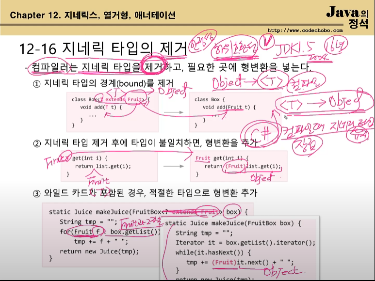

  1. 지네릭 타입의 경계(bound) 를 제거

  2. 지네릭 타입 제거 후에 타입이 불일치하면, 형변환을 추가

  3. 와일드 카드가 포함된 경우, 적절한 타입으로 형변환 추가

     

- 쉽게 얘기해서, **하위호환성 때문에** 컴파일 되면 지네릭스는 없어지고 컴파일러가 알아서 형변환등 을 해준다.

# 12-17 열거형(enum)

- **관련된 상수들을 같이 묶어 놓은 것**. Java는 타입 (**타입 & 값을 체크**)에 안전한 열거형을 제공

  ```java
  class Card{
      static final int CLOVER = 0;
      static final int HEART = 1;
      static final int DIAMOND = 2;
      static final int SPADE = 3;
      
      static final int TWO = 0;
      static final int THREE = 1;
      static final int FOUR = 2;
      
      final int kind;
      final int num;
  }
  ```

  ```java
  class Card{
      enum Kind { CLOVER, HEART, DIAMOND, SPADE }	// 열거형 Kind 를 정의
      enum Value { TWO, THREE, FOUR }				//열거형 Value 를 정의
      
      final Kind kind;	// 타입이 int 가 아닌 Kind 임에 유의하자
      final Value value;
  }
  
  Card.Kind.CLOVER == Card.Value.TWO	// false, Java 는 단순히 값만 비교하지 않고, Kind, Value 라는 타입 도 체크를 해
      								// 같은 값을 가지는 enum 이라도 다르다고 판단을 할 수 있다.
  ```

# 12-18 열거형의 정의와 사용

- 열거형을 정의하는 방법

  `enum 열거형이름 { 상수명1, 상수명2, 상수명3, ~}`

  ```java
  enum Direction { EAST, SOUTH, WEST, NORTH }
  ```

  

- 열거형 타입의 변수를 선언하고 사용하는 방법.

  ```java
  class Unit{
      int x, y;			// 유닛의 위치
      Direction dir;		// 열거형 인스턴스 변수 선언
      
      void init(){
          dir = Direction.EAST;	// 유닛의 방향을 EAST 로 초기화
      }
  }
  ```

  

- 열거형 상수의 비교에 **'=='** 와 **compareTo()** 사용가능 <--> 비교 연산자는 안됨!!!

  ```java
  if(dir == Direction.EAST){
  	x++;	//ok
  }else if(dir > Direction>.EAST){	// error. enum 에는 비교연산자(>, <) 사용 불가
      //~
  }else if(dir.compareTo(Direction.WEST) > 0){	// compareTo() 는 사용 가능함.
      //~
  }
  ```

# 12-19 열거형의 조상 - java.lang.Enum

- 모든 열거형은 java.lang.Enum(클래스) 의 자손이고, 아래의 메서드를 상속받는다. 

  |                  메서드                   |                             설명                             |
  | :---------------------------------------: | :----------------------------------------------------------: |
  |       Class<E> getDeclaringClass()        | 열거형의 Class 객체를 반환 /<br />이 전에 배웠던 getClass() 랑 비슷함. |
  |               String name()               |              열거형 상수의 이름을 문자열로 반환              |
  |               int ordinal()               |         열거형 상수가 정의된 순서를 반환(0부터 시작)         |
  | T valueOf(Class<T> enumType, String name) |    지정된 열거형에서 name 과 일치하는 열거형 상수를 반환     |

- values(), valueOf() 는 컴파일러가 자동으로 추가

  ```java
  static E[] values();
  static E valueOf(String name);
  
  Direction[] dArr = Direction.values();
  
  for(Direction d : dArr)
      System.out.printf("%s=%d%n", d.name(), d.ordinal());
  
  Direction d = Direction.valueOf("WEST");
  ```

  `이것들을 언제 쓰냐` 라는 생각보단, 일단 `이런 게 있다` 정도로만 알고 있자!

- **보통 `Direction.EAST` 이렇게 제일 많이 쓴다.**

- **Enum 안에 있는 것들은 단순한 값이 아니라 객체이다!**

- 참조) Ex12_5 

# 12-21 열거형에 멤버 추가하기

- 불연속적인 열거형 상수의 경우, 원하는 값을 괄호( ) 안에 적는다

  ```java
  enum Direction {EAST(1), SOUTH(5), WEST(-1), NORTH(10)}
  ```

  

- 괄호() 를 사용하려면, 인스턴스 변수와 생성자를 새로 추가해 줘야 한다.

  ```java
  enum Direction{
      EAST(1), SOUTH(5), WEST(-1), NORTH(10);
      
      private final int value;	// 정수를 저장할 필드(인스턴스 변수) 를 추가
      Direction(int value) {this.value = value}	// 생성자를 추가, private 이 원래 있지만, 너무 당연한거라 묵시적으로 없앰.
      // 인터페이스에서 static final 생략하는 거랑 비슷한 느낌인듯?
      
      public int getValue() {
          return value;
      }
  }
  ```

  위에서 **`EAST(1)` 이렇게 한 건 생성자를 호출한 것이다.**

- 열거형의 생성자는 암묵적으로 private 이므로, 외부에서 객체 생성 불가

  : 암묵적으로 private 이라 private 을 안쓴다.

  ```java
  Direction d = new Direction();	// error. 열거형의 생성자는 외부에서 호출 불가함.
  ```

- 참조) Ex12_6

# 12-23 애너테이션이란?

- 주석처럼 프로그래밍 언어에 영향을 미치지 않으며, 유용한 정보를 특정 프로그램에게 제공하는 것.

  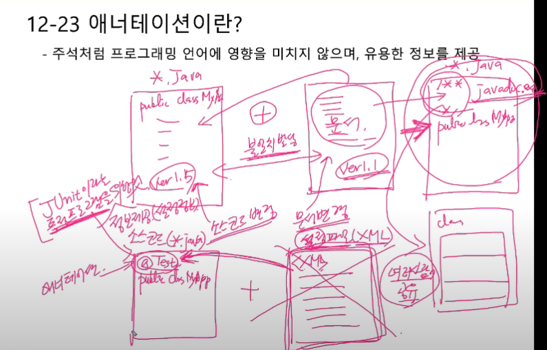

- 애너테이션의 사용예

  ```java
  @test	// 이 메서드가 테스트 대상임을 테스트 프로그램에게 알린다.
  public void method(){
      //~
  }
  ```

# 12-24 표준 애너테이션

- java에서 제공하는 애너테이션

  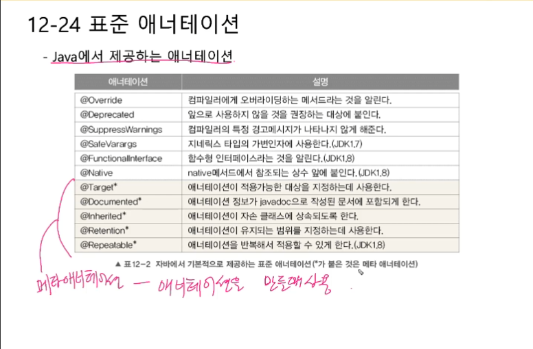

# 12-25 @Override -> javac.exe 가 사용함

- 오버라이딩을 올바르게 했는 지 컴파일러가 체크하게 한다.

- 오버라이딩 할 때, 메서드 이름을 잘못적는 실수는 하는 경우가 많다.

  ```java
  class Parent{
      void parentMethod(){};
  }
  
  class Child extends Parent{
      void parentmethod(){};	// 오버라이딩의 의도로 썼지만, 얘는 오버라이딩이 아니라, 그냥 새로운 함수를 선언한 것과 다름이 없다.
  }
  ```

- 오버라이딩 할 때는 메서드 선언부 앞에 @Override 를 붙이자

  ```java
  class Child extends Parent{
      @Override
      void parentMethod();
  }
  ```

  ```java
  Ex12_7.java:6: error: method does not override or implement a method from a supertype
  	@Override
  1 error
  ```

- 참조)Ex12_7

# 12-26 @Deprecated

- 앞으로 사용하지 않을 것을 권장하는 필드나 메서드에 붙인다

- @Deprecated의 사용 예, Date 클래스의 getDate()

  ```java
  @Deprecated
  public int getDate(){
      return normalize().getDayOfMonth();
  }
  ```

  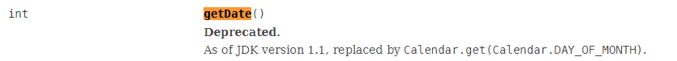

  쓰지 말라고 할 거면 왜 냅두냐? 

  : JAVA 의 하위 호환성 때문에!

  

- @Deprecated 가 붙은 대상이 사용된 코드를 컴파일 하면 나타나는 메세지

  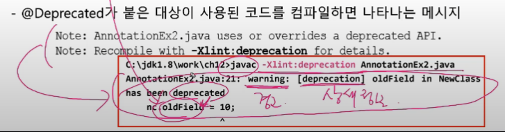

  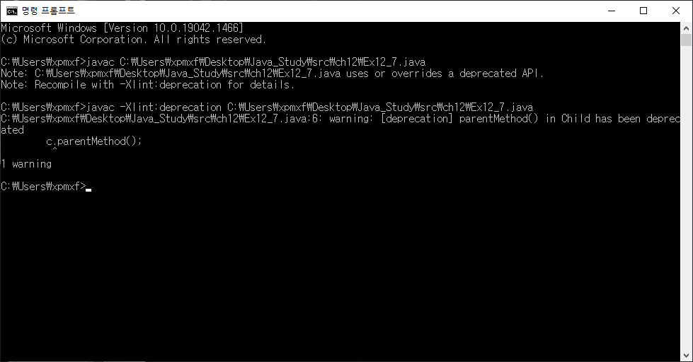

  이건 에러가 아닌 경고임을 명시하자!

- 참조) Ex12_7

# 12-27 @FunctionalInterface 

- 함수형 인터페이스는 14장 에서 배울것!

  

- 함수형 인터페이스에 붙이면, 컴파일러가 올바르게 작성했는 지 체크

  **함수형 인터페이스에는 딱 하나의 추상메서드만 가져야 한다는 제약이 있음**

  ```java
  @FunctionalInterface
  public interface Runnable{
      public abstract void run();	//추상 메서드, 만약 추상메서드가 2개 이상을 가지게 되면 컴파일러가 잡는다
      // 0 개 여도 잡는다
  }
  ```

  

- 참조) Ex12_7

# 12-28 @SuppressWarnings

- 컴파일러의 경고메세지가 나타나지 않게 억제한다.

- 괄호() 안에 억제하고자하는 경고의 종류를 문자열로 지정

  ```java
  @SuppressWarnings("unchecked")		// 지네릭스와 관련된 경고를 억제
  ArrayList list = new ArrayList();	// 지네릭 타입을 지정하지 않음
  list.add(obj);					  // 그래서 여기서 경고가 발생함
  ```


- 둘 이상의 경고를 동시에 억제하려면 다음과 같이 한다

  ```java
  @SuppressWarnings("unchecked", "deprecation", "rawtypes", "varargs");
  ```

  

- `-Xlint` 옵션으로 컴파일 하면, 경고메세지를 확인할 수 있다.

  [ ] 이런 괄호 안에 있는 것이 경고의 종류이고, 이를 @SuppressWarnings( ) 안에 넣으면 무시 됨.

  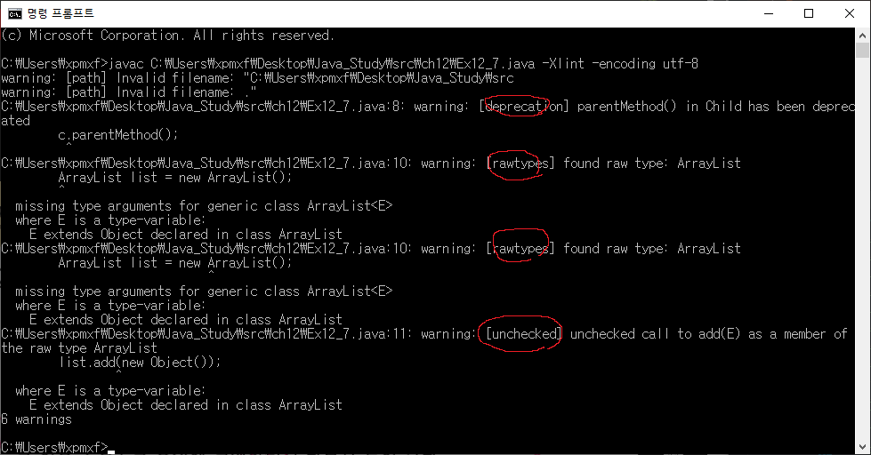

- 참조) Ex12_7

# 12-29 메타 애너테이션

- 메타 애너테이션은 `애너테이션을 위한 애너테이션`

- 메타애너테이션은 java.lang.annotation 패키지에 포함

  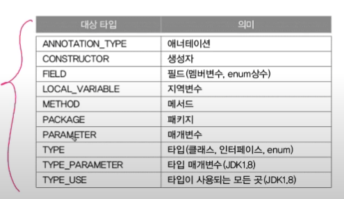

# 12-30 @Target

- 애너테이션을 정의할 때, 적용대상 지정에 사용

  ```java
  @Target({TYPE, FIELD, METHOD, PARAMETER, CONSTRUCTOR, LOCAL_VARIABLE})
  @Retention(RetentionPolicy.SOURCE)
  public @interface SuppressWarnings{
      String[] value;
  }
  ```

  TYPE - 클래스

  FIELD - iv, cv

  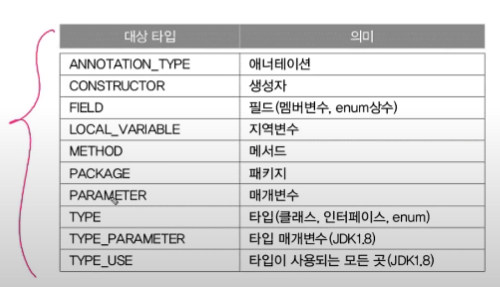

  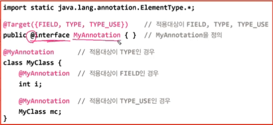

# 12-31 @Retention

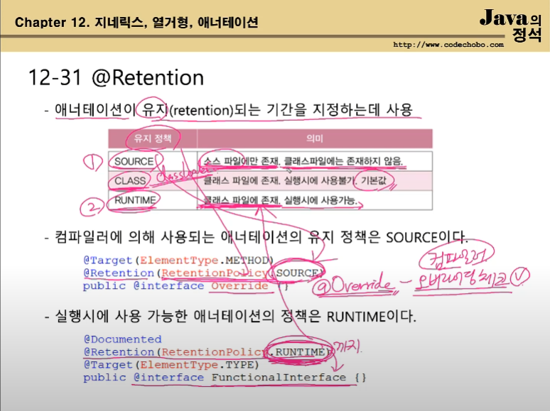

- CLASS 는 거의 안 쓴다고 하심
- @Override 의 경우, 컴파일러가 체크만 하는 것이기에, @Retention(RetentionPolicy.SOURCE) 이다.

# 12-32 @Documented, @Inherited

- javadoc 으로 작성한 문서 (결과물이 html 로 나오게 된다) 에 포함시키려면 @Documented 를 붙인다

  ```java
  @Documented
  @Retention(RetentionPolicy.RUNTIME)
  @Target(ElementType.TYPE)
  public @interface FunctionalInterface{
      
  }
  ```

  근데 @Documented 우리가 거의 쓸 일이 없다고 하셨다

  

- 애너테이션을 자손 클래스에 상속하고자 할 때, @Inherited 를 붙인다.

  ```java
  @Inherited				//@SuperAnno 가 자손까지 영향 미치게
  @interface SuperAnno{}	//조상 애너테이션
  
  @SuperAnoo
  class Parent{}
  
  class Child extends Parent{}	// Child 에 애너테이션이 붙은 것으로 인식
  ```

  많이 사용되는 애너테이션이 아니니까, 이런 게 있다는 것만 알자

# 12-33 @Repeatable

- 반복해서 붙일 수 있는 애너테이션을 정의할 때 사용

  ```java
  @Repeatable(ToDos.class)
  @interface ToDo{
      String value();
  }
  ```

  이런 것이 있다는 것만 알고 있자...

  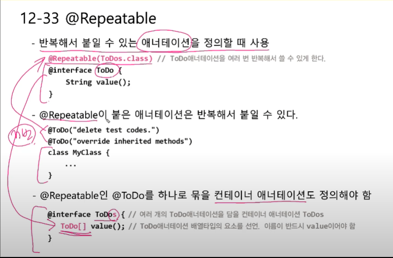

# 12-34 애너테이션 타입 정의하기

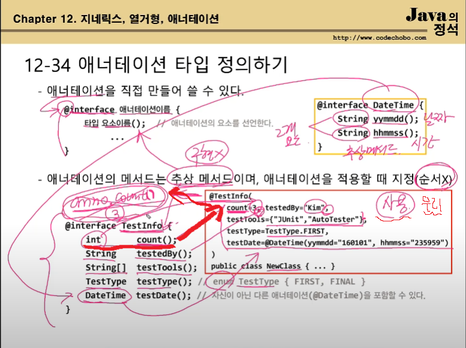

- 애너테이션을 직접 만들어 쓸 수 있다

  ```java
  @interface 애너테이션 이름{
      타입 요소이름();
  }
  
  // 예시
  @interface DateTime{
      String yymmdd();
      String hhmmss();
  }
  ```

  

- 애너테이션의 메서드는 추상 메서드이며, 애너테이션을 적용할 때 지정(순서x)

  ```java
  @interface TestInfo{
      int count();
      String testedBy();
      String[] testTools();
      TestType testType();	//enum TestType {FIRST, FINAL}
      DateTime testDate();	// 자신이 아닌 다른 애너테이션(@DateTime) 을 포함 가능
  }
  ```

# 12-25 애너테이션의 요소

- 적용시 값을 지정하지 않으면, 사용될 수 있는 기본값 지정 가능(null 제외)

  ```java
  @interface TestInfo{
      int count() default 1;		// count 의 기본 값을 1 로 지정함
  }
  
  @TestInfo					  // count 에 대한 값을 지정 안해줬으니,count()==1임	
  public class MyClass{ /**/ }
  ```

  

- 요소가 하나이고, 이름이 value일 때는 요소의 이름 생략 가능

  ```java
  @interface TestInfo{
      String value();
  }
  
  @TestInfo("passed")		// @TestInfo(value="passed") 와 동일함.
  class MyClass{ /**/ }
  ```

  

- 요소의 타입이 배열인 경우, 괄호{} 를 사용해야 한다.

  ```java
  @interface TestInfo{
      String[] testTools();
  }
  
  @Test(testTools={"JUnit", "AutoTester"})
  @Test(testTools="JUnit")	// 만약 값을 1개만 넣는거면 {} 생략 가능
  @Test(testTools={})	// 값이 없을 때는 반드시 {} 를 써줘야한다.
  ```

# 12-36 모든 애너테이션의 조상 

- java.lang.annotation.Annotation 

  

- Annotation 은 모든 애너테이션의 조상이지만, 상속은 불가

  ```java
  @interface TestInfo extends Annotation {	// error. extends Annotation 은 안됨
      int count();
      String testedBy();
  }
  ```

  

- 사실 Annotation 은 interface 이다

  ```java
  package java.lang.annotation;
  
  public interface Annotation{
      // 아래 3가지 메서드는 추상메서드임. 구현하지 않아도, 컴파일러가 알아서 구현해준다.
      // 그래서 모든 annotation 들은 아래 메서드들을 가지고, 우리는 사용할 수 있다.
      boolean equals(Object obj);
      int hashCode();
      String toString();
      
      Class<? extends Annotation> annotationType();	// 애너테이션의 타입 반환
  }
  ```

  

# 12-37 마커 애너테이션 - Marker Annotation

- 요소가 하나도 정의되지 않은 애너테이션

  ```java
  @Target(ElementType.METHOD)
  @Retention(RetentionPolicy.SOURCE)
  public @interface Override{}	// 마커 애너테이션. 정의된 요소가 없으니까
  
  @Target(ElementType.METHOD)
  @Retention(RetentionPolciy.SOURCE)
  public @interface Test{}		// 마커 애너테이션. 정의된 요소가 없어서
  
  @Test				// 정의된 요소 없음!
  public void method(){
      
  }
  
  @Deprecated			// 정의된 요소 없음!
  public int getDate(){
      return normalize().getDayOfMonth();
  }
  ```

  이렇게 불리운다 정도로만 알자

# 12-38 애너테이션 요소의 규칙

- 애너테이션의 요소를 선언할 떄 아래의 규칙을 반드시 지켜야 한다.

  1. 요소의 타입은 기본형, String, enum, 애너테이션, Class 만 허용됨
  2. 괄호 () 안에 매개변수를 선언할 수 없다.
  3. 예외를 선언할 수 없다.
  4. 요소를 타입 매개변수로 정의할 vb수 없다

  

- 아래의 코드에서 잘못된 부분을 짚어보자

  ```java
  @interface AnnoTest{
      int id = 100;			// 상수 ok, default 메서드는 안됨.
      String major(int i, int j);
      String minor() throws Exception;
      ArrayList<T> list();
  }
  ```

  

- 참조) Ex12_8