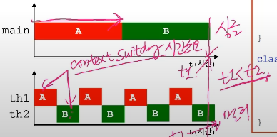

## 13-1 프로세스와 쓰레드(process & thread)

- 프로세스란? 

  실행 중인 프로그램
  
  자원(resources, == 메모리, CPU)과 쓰레드로 구성
  
  
  
- 쓰레드란?

  프로세스 내에서 실제 작업을 수행.

  모든 프로세스는 최소한 하나의 쓰레드를 가지고 있다.

  > 프로세스 : 쓰레드 = 공장 : 일꾼

  

- 싱글 쓰레드 프로세스

  = 자원 + 쓰레드

  지금까지 우리가 작성하던 코드들이 싱글 쓰레드 프로세스이다.

  

- 멀티 쓰레드 프로세스

  = 자원 + 쓰레드 + 쓰레드 + 쓰레드 + (등등) + 쓰레드

  여러 작업을 나눠서 동시에 하기에, 효율적이다

  우리가 사용하는 대부분 프로그램은 멀티 쓰레드 프로세스이다.

  

  

- `하나의 새로운 프로세스를 생성하는 것 보다, 하나의 새로운 쓰레드를 생성하는 것이 더 적은 비용이 든다`

  2 프로세스 1 쓰레드 vs 1 프로세스 2 쓰레드

  

  

## 13-2 멀티쓰레드의 장단점

> 대부분의 프로그램이 멀티쓰레드로 작성되어 있다. 
> 그러나, 멀티쓰레드 프로그래밍이 장점만 있는 것은 아니다.

| 장점                                                         | 단점                                                         |
| ------------------------------------------------------------ | ------------------------------------------------------------ |
| - 시스템 자원을 보다 효울적으로 사용할 수 있다<br />- 사용자에 대한 응답성(responseness)이 향상된다.<br />- 작업이 분리되어, 코드가 간결해 진다.<br />>> 여러 모로 좋다! | - 동기화(synchronization)에 주의해햐 한다. (자원 공유땜시)<br />- 교착상태(dead-lock)가 발생하지 않도록 주의해야 한다.<br />- 각 쓰레드가 효율적으로 고르게 실행될 수 있게 해야 한다. (기아 현상) |

코드 짜는 건 쉬워도, 좋은 코드를 만들어내는 건 어렵듯이,

멀티쓰레드 짜는 건 쉽지만, 잘 구현시키기는 어렵다!


## 13-3 쓰레드의 구현과 실행

1. Thread 클래스를 상속

   Java 에서는 단일상속 밖에 되지 않아, 한번 상속되면 끝이다.

   ```java
   class MyThread extends Therad {
       @override
       public void run(){
    		/* 작업내용 */       
       }
   }
   ```

   ```java
   MyThread t1 = new myThread(); // 쓰레드의 생성
   t1.start();	// 쓰레드의 실행
   ```

   

2. Runnable 인터페이스를 구현 ( 이게 better! )

   ```java
   class MyThread2 implements Runnable {
       @override
       public void run(){
           /* 작업내용 */
       }
   }
   ```

   ```java
   Runnable r = new MyThread2();	// Runnable 을 구현해서, 
   Thread t2 = new Thread(r);	// Thread(Runnable r) == run() 을 구현한 객체를 받는 다!
   
   t2.start();	// 쓰레드 실행
   ```

   

   Runnable 인터페이스는 다음과 같이 생겼다

   ```java
   public interface Runnable{
       public abstract void run();
   }
   ```

   

   뭐가 됐던, run() 안에다가 작업할 내용을 넣는 다!

- 참조) Ex13_1

  

## 13-5 쓰레드의 실행 - start( )

- **쓰레드를 생성**한 후에 **start() 를 호출**해야 쓰레드가 작업을 시작한다.

  ```java
  ThreadEx1_1 t1 = new ThreadEx1_1();
  ThreadEx1_2 t2 = new ThreadEx1_2();
  
  t1.start();
  t2.start();
  ```

  1. start 했다고 바로 실행되는 게 아니라, **실행 가능한 상태**로 준비가 되는 것이다!

  2. t2 보다 t1 이 먼저 실행될 가능성이 있다만, 정해져 있지 않다. **순서는 OS 스케쥴러에 의해서 결정됨!**

     2번의 특징때문에, `JVM 은 OS에 종속적이다` 라고도 한다!

     

## 13-6 start() 와 run()

```java
class MyThread extends Thread{
    public void run(){
        /* 작업 내용 */
    }
}

class ThreadTest{
    public static void main(String[] args){
        MyThread t1 = new MyThread();	// 쓰레드 생성
        t1.start();							  // 쓰레드 실행
    }
}
```


## 13-7 main 쓰레드

- main 메서드의 코드를 수행하는 쓰레드

  ```java
  public class Hello {
      public static void main(String[] args) {
          System.out.println("Hello");
      }
  }
  ```

  

- 쓰레드는 **"사용자 쓰레드"** 와 **"데몬 쓰레드 ( == 보조 쓰레드)"** 두 종류가 있다.


- > 실행 중인 **사용자 쓰레드**가 하나도 없을 때, 프로그램은 종료된다.

  


- 참조)Ex13_11 ,

  쓰레드의 메서드 중 join() 을 쓰면, 해당 쓰레드가 만든 스택이 사라질 때 까지 기다리게 된다.


## 13-8 싱글쓰레드와 멀티쓰레드

- 싱글 쓰레드

  ```java
  class ThreadTest {
      public static void main(String[] args) {
          for(int i = 0 ; i < 300; i++ ) {	// A
              System.out.println("-");
          }
          
          for(int i = 0 ; i < 300; i++ ) {	// B
              System.out.println("|");
          }
      }	// main
  }
  ```

  

- 멀티 쓰레드

  ```java
  class ThreadTest {
      public static void main(String[] args){
          MyThread1 t1 = new MyThread1();
          MyThread2 t2 = new MyThread2();
          t1.start();
          t2.start();
      }
  }
  
  class MyThread1 extends Thread {
      public void run() {
          for(int i = 0 ; i < 300; i++ ) {
              System.out.println("-");
          }
      }
  }
  
  class MyThread2 extends Thread {
      public void run() {
          for(int i = 0 ; i < 300; i++ ) {
              System.out.println("|");
          }
      }
  }
  ```

  

  

  두 작업 A 와 B 간에 스위칭을 할 때, 이것을 `context switching` 이라고 한다.

  

  위 그림을 보면 멀티쓰레드가 싱글 쓰레드보다 시간이 더 걸린다. 그럼 왜 쓰냐?

  `동시에 작업을 할 수 있다는 효율성` 을 지니기 때문이다!

  그리고 다음 I/O 블락킹에서 배울 `자원의 효율성도 있다!`


## 13-11 쓰레드의 I/O 블락킹(blocking)

- I/O 는 입출력을 의미하고
- I/O blocking 은 입출력시 작업 중단하는 것

```java
class ThreadEx6 {
    public static void main(String[] args) {
        String input = JOptionPane.showInputDialog("아무 값이나 입력하세요");
        System.out.println("입력하신 값은 " + input + " 입니다. " );
        
        for(int i = 10 ; i > 0  ; i-- ) {
            System.out.println(i);
            try{
                Thread.sleep(1000);	// 카운트다운
            }
        }
    }
}
```

위처럼 하게 되면, input 을 넣는 동안 모든 쓰레드는 동작을 멈추게 된다. 

이는 `CPU 라는 자원의 비효율성을 초래하게 된다.`

```java
class ThreadEx7 {
    public static void main(String[] args) {
        ThreadEx7_1 th1 = new ThreadEx7_1();
        th1.start();
        
        String input = JOPtionPane.showInputDialog("아무값이나 입력하세요");
        System.out.println("입력하신 값은 " + input + " 입니다");
    }	// main();
}

class ThreadEx7_1 extends Thread {
    public void run() {
        for(int i = 10 ; i > 0 ; i -- ) {
            System.out.println(i);
            try{
                sleep(1000);
            }catch(Exception e){}
        }
    }	// run()
}
```

하지만 이렇게 멀티쓰레드로 돌리게 되면 input 을 입력하는 와중에도 카운트다운이 굴러가게 되므로,

`멀티쓰레드의 자원의 효율성`을 알 수 있다.


이 그림은 하이라이트 된 부분을 그림으로 잘 보여준다.


- 참조)Ex13_4, Ex13_5

  Ex13_5 에서 보면, `ThreadEx5_1 의 start() 를 먼저 해줘야 카운트다운이 되는 와중에 InputDialog 가 뜨게 된다.`

  

  그리고 input 값을 넣지 않고 있으면, 프로그램은 종료가 되지 않는 다. 왜?

  `아직 모든 사용자 쓰레드가 종료가 되지 않았기 때문에!`


## 13-14 쓰레드의 우선순위(priority of thread)

- `쓰레드중, 작업의 중요도에 따라 쓰레드의 우선 순위를 다르게 하여 특정 쓰레드가 더 많은 작업시간을 갖게 할 수 있다.`

  ```java
  void setPriority(int newPriority);	// 쓰레드의 우선순위를 지정한 값으로 변경한다.
  int getPriority();	// 쓰레드의 우선 순위를 반환한다.
  
  public static final int MAX_PRIORITY = 10;		//최대 우선 순위
  public static final int MIN_PRIORITY = 1;		// 최소 우선 순위
  public static final int NORM_PRIORITY = 5;		// 보통 우선 순위
  ```

  JVM 에서는 1 ~ 10 의 우선 순위 단계를 가지고 있지만 

  OS 에서는 자체적인 단계가 있다. (Windows 의 경우 32단계가 있음.)

  

  단계가 있지만, 사실 설정한다고 해서 우리 마음대로 되지 않는 다. 

  언제다 그렇듯, OS 스케줄러에 의해서 결정이 되기 때문에 저렇게 정하는 것은

  `우리의 희망사항을 적는, 확률을 조금 올리는 수준정도이다.`

  

  

- 참조)Ex13_6


## 13-16 쓰레드 그룹

- 서로 관련된 쓰레드를 그룹으로 묶어서 다루기 위한 것.

  

- 모든 쓰레드는 반드시 하나의 쓰레드 그룹에 포함되어 있어야 한다

  하지만 지금까지 쓰레드를 생성할 때 우리는 쓰레드 그룹을 만들지 않았다. 

  이에 대한 해답은?

  

- 쓰레드 그룹을 지정하지 않고 생성한 쓰레드는 `main쓰레드 그룹` 에 속하게 된다.

  

- 자신을 생성한 쓰레드(부모 쓰레드)의 `그룹과 우선순위를 상속`받는 다. (main 은 5!)

  


## 13-17 쓰레드 그룹의 메서드 


- 대부분 쓰레드 그룹에 대한 정보들

  

- 쓰레드 그룹에 속하는 모든 쓰레드들에게 일괄적으로 영향을 주는 메서드도 있고

  

- 개별적으로 영향을 줄 수도 있다

  

## 13-18 데몬 쓰레드(Daemon Thread)

- 일반 쓰레드(non-daemon thread) 의 작업을 돋는 보조적인 역할을 수행함

  

- 일반 쓰레드가 모두 종료되면, 자동적으로 종료된다.

  일반 쓰레드를 보조하기 위한 역할이니, 일반 쓰레드가 없으면 종료되는 게 맞다!

  

- 가비지 컬렉터(GC), 자동저장, 화면 자동갱신 등에 사용된다.

  

- `언제 일반 쓰레드가 들어올 지 모르니 무한루프로 켜두고, if 조건문을 이용해 특정 조건을 충족했을 때 동작하도록 한다!`

  ```java
  boolean isDaemon();			// 쓰레드가 데몬 쓰레드인지 확인한다. 데몬 쓰레드이면 true를 반환
  void setDaemon(boolean on);	// 쓰레드를 데몬 쓰레드로 또는 사용자 쓰레드로 변경. 매개변수 on 을 true 로 지정하면 데몬 쓰레드가 된다.
  ```

  데몬 쓰레드를 사용하는 방법은 `무한루프&조건문` 의 방법이 거의 고정이다!


- setDaemon(boolean on) 은 반드시 start() 를 호출하기 전에 실행되어야 한다.

  그렇지 않으면 IllegalThreadStateException 이 발생한다!

  

- 참조)Ex13_7

  

## 13-20 쓰레드의 상태


갓궁성은 쓰레드가 인기 있는 그네를 타는 것에 비유함!

`suspend() <-> resume()`

`wait() <-> notify()`

`sleep() <-> interrupt()` : 원래 sleep(5* 1000) 하면 5초 후에 time-out 되면서 해제되는 데, 5초 전에 깨울일 있으면 interrupt() 를 호출해서 강제 time-out 시킴


## 13-21 쓰레드의 실행 제어

- 쓰레드의 실행을 제어할 수 있는 메서드가 제공된다.

  이 들을 활용해서, 보다 효율적인 프로그램을 작성할 수 있다.

  

  `static` 이 붙은 sleep(), yield() 는 자기 자신에게만,

  나머지는 다른 쓰레드에게 명령하는 것이다!

  

## 13-22 static sleep()

- Thread 실행 제어 메서드 중 static 이 붙은 건 단 2 가지이다.

  1. sleep(); - 지정 시간 동안 멈추게 하기
  2. yield(); - 양보

  

- 현재 쓰레드를 지정된 시간 동안 멈추게 한다.

  ```java
  static void sleep(long millis);				// 천 분의 일초 단위
  static void sleep(long millis, int nanos);	// 천 분의 일초 + 나노초
  ```

  

- sleep() 은 예외처리를 해줘야 한다. (InterruptedException이 발생하면 깨어남)

  ```java
  try {
      Thread.sleep(1, 500000);		// 여기서 자는 동안 누가 깨운다? 그러면 throw new InterruptedException();
  } catch(InterruptedException e) {}	
  ```

  sleep 상태의 쓰레드가 깨어나는 종류는 다음과 같이 2 가지이다.

  1. time up
  2. interrupted

  

  예외라고 해서, 뭔가를 해야 하는 게 아니다. 

  오히려 이건 try-catch 를 이용해 `다 sleep  하고 일어나냐 / 중간에 일어나냐 ` 를 구분한 거!

  그니까 catch 안에는 별 거 안 넣어도 된다.

  

  하지만 위처럼 sleep() 할 때 마다 일일히 try-catch 하는 게 귀찮으니, 다음과 같이 delay() 메서드를 구현해버린다!

  ```java
  void delay(long millis){
      try{
          Thread.sleep(millis);
      }catch(InterruptedException e){};
  }
  ```

  

- 특정 쓰레드를 지정해서 멈추게 하는 것은 불가능하다!

  ```java
  // 이렇게 쓰는 건
  try{
      th1.sleep(2000);	
  }catch(InterruptedException e){};
  ```

  일단 이 코드는 오류가 나지 않는 다.

  코드만 봤을 때는 th1 을 sleep() 시키는 거 같다. 하지만 그게 아니라,

  현재 try catch 문을 실행시키는 쓰레드를 sleep() 시키는 것이다.

  ```java
  // 이렇게 쓰는 것과 같다.
  try{
      Thread.sleep(2000);
  }catch(InterruptedException e){};
  ```

  그래서 sleep() 이 static 이고, 이렇게 써주는 게 맞다.

  

- 참조)Ex13_8

  

## 13-24 Interrupt()

- 대기상태(WAITING) 인 쓰레드를 실행대기 상대(RUNNABLE)로 만든다.

  `대기상태란, sleep()/join()/wait() 으로 작업이 중단된 상태이다!`

  ```java
  void interrupt();					// 쓰레드의 interrupted 상태를 false에서 true 로 변경
  boolean isInterrupted();		 	// 쓰레드의 interrupted 상태를 반환.
  static boolean interrupted();		// ***현재 쓰레드***의 interrupted 상태를 알려주고, false 로 초기화
  ```

  2 번째랑 3 번째랑 비슷함. 

  다만 3 번째는 false 로 초기화시킴

  

- 사용 예시

  ```java
  public static void main(String[] args){
      ThreadEx13_2 th1 = new ThreadEx13_2();
      th1.start();
      /*~~*/
      th1.interrupt();	// interrupt() 를 호출하면, interrupted 상태가 true 로 변함
      /*~~*/
      System.out.println("isInterrupted() = " + th1.isInterrupted());
  }
  ```

  

- 이해하기 쉬우라고 있는 Thread 클래스

  ```java
  class Thread {
      /*~~*/
      boolean interrupted = false;
      /*~~*/
      boolean isInterrupted() {
          return interrupted;
      }
  	
      boolean interrupt() {
          interrupted = true;
      }
  }
  ```

  대략 이렇게 생겨먹었다고 생각하면 이해가 쉬울 것이다!

  

- Interrupt 사용 예시

  

  ```java
  class ThreadEx13_2 extends Thread{
      public void run(){
          /*~~*/
          while( downloaded && !isInterrupted() ){
              // download 수행 코드
          }
          
          System.out.println("다운로드가 끝났습니다");
      }
  }
  ```

  

- 참조) Ex13_9

  예제 확인하자. 예제의 패턴으로 거의 진행된다고 하심.

  

## 13-26 suspend(), resume(), stop()

- `쓰레드의 실행을 일시정지, 재개, 완전정지 시킨다.`

  ```java
  void suspend();		쓰레드를 일시정지 시킨다
  void resume();		suspend() 에 의해 일시정지 된 쓰레드를, 실행대기상태로 만든다.
  void stop();		 쓰레드를 즉시 종료시킨다.
  ```

  

  이 표를 보고서는 start(), suspend(), resume(), stop() 의 과정을 한번 생각해보기

  

- 근데 suspend(), resume(), stop() 메서드들은 deprecated 됨. 

  왜냐하면 dead-lock, 즉 교착 상태를 일으킬 수 있기 때문에!

  **dead-lock 이란?

  쓰레드 A, B 가 있는 데 A 는 B 가 원하는 걸 가지고 있고 / B 는 A가 원하는 걸 가지고 있는 상태

  

- 그러면 대체 어떻게 해야하냐?

  우리가 직접 선언해야 한다!

  ```java
  class ThreadEx17_1 implements Runnable {
      boolean suspended = false;
      boolean stopped = false;
      
      public void run() {
          while(!stopped) {
              if(!suspended){
                  /* 작업 내용 */
              }
          }
      }
      
      public void suspend(){ suspended = true }
      public void resume(){ suspended = false }
      public void stopped(){ stopped = true }
  }
  ```

  

- 참조) Ex13_10

  volatile!

  

## 13-28 join()

- 지정된 시간 동안 특정 쓰레드가 작업하는 것을 기다린다.

  쓰레드 A, B 가 있을 때, 만약 A 가 B 의 작업 이후에 진행이 되어야 한다! 라는 경우 사용함.

  ```java
  void join()								작업이 모두 끝날 때까지
  void join(long millis)					천분의 일초 동안
  void join(long millis, int nanos)	   천분의 일초 + 나노초 동안
  ```

  

- 예외처리를 해야 한다. (InterruptedException이 발생하면 작업 재개)

  ```java
  public static void main(String[] args) {
      ThreadEx19_1 th1 = new ThreadEx19_1();
      ThreadEx19_2 th2 = new TheradEx19_2();
      th1.start();
      th2.start();
      startTime = System.currentTimeMillis();
      
      try{
          th1.join();
          th2.join();
      }catch(InterruptedException e){}
      
      System.out.print("소요시간 : " + (System.currentTimeMillis() - startTime)
  }
  ```

  만약 InterruptedException 이 발생하면, join() 하던 걸 멈추게 된다.


- 참조)Ex13_11 

  ```java
  try{
      th1.join();
      th2.join():
  }catch(InterruptedException e){}
  ```

  이렇게 있는 데, 여기서 th2.join() 을 주석처리하면,

  main 쓰레드는 th1이 끝난 직후에만 끝나게 된다.

  th1.join(), th2.join() 두 개 주석처리 했다 풀었다 하면서 보면 좋을 듯


## 13-28 join() 예시

Garbage collector( == 데몬쓰레드 ) 를 흉내내본 코드

```java
public void run() {	// GC 구현, 데몬 쓰레드
    while(true) {
        try{
            Thread.sleep(10 * 1000);
        } catch (InterruptedException e) {
            System.out.println("Awaken by interrupt().");
        }
        
        gc();	// garbage collection을 수행한다. == 사용하지 않는 객체를 제거함
        System.out.println("Garbage collected. Free Memory : " + freeMemory());
    }
}
```

```java
for(int i = 0 ; i < 20 ; i++) {
    requiredMemory = (int) (Math.random() * 10) * 20;
    
    // 필요한 메모리가, 사용할 수 있는 양보다 적거나/전체 메모리의 60%이상 사용했을 경우 gc를 interrupt() 로 깨운다.  
    if(gc.freeMemory() < requiredMemory || gc.freeMemory() < gc.totalMemory() * 0.4) {
        gc.interrupt();
        
        try{
            gc.join(100);	// gc가 메모리를 정리할 시간을 줘야 하기에, 이 부분을 정리해야 함
        } catch (InterruptedException e){ }
    }
    gc.usedMemory += requiredMemory;
    System.out.println("usedMemory : " + gc.usedMemory);
}
```

이 예시를 잘 기억하라고 하심!


## 13-28 yield() - static 이라 자기 자신만 가능함

- 남은 시간을 다음 쓰레드에게 양보하고, 자신(현재 쓰레드)은 실행대기한다 == RUNNABLE으로 간다.

  

  원래 실행시 5 초가 소요된다고 할 때,

  yield() 를 사용하면 2, 3초만 사용하고 RUNNABLE 로 다시 감


- yield() 와 interrupt() 를 적절히 사용하면, 응답성과 효율을 높일 수 있다.

  ```java
  class MyThreadEx18 implements Runnable {
      boolean suspended = false;
      boolean stopped = false;
      
      Thread th;
      
      MyThreadEx18(String name) {
          th = new Thread(this, name);
      }
      
      public void run() {
          while(!stopped) {
              if(!suspended) {
                  /*
                  작업수행
                  */
                  try {
                      Thread.sleep(1000);
                  } catch (InterruptedException e) {}
              } else {
                  Thread.yield();	
              } // if
          } // while
      }
  }
  
  ```

  만약 suspended == true 라면, 무한 while 루프를 돌게 된다. 이를 busy-waiting 이라고도 함.

  busy-waiting 은 되게 비효율적이라서, yield() 를 사용해 suspended 되면 다른 애들한테 양보하는 형태로 만든다.

  ```java
  public void start() {
      th.start();
  }
  
  public void resume() {
      suspended = false;
  }
  
  public void suspend() {
  	suspended = true;
      th.interrupt();			위의 코드 블럭에서 보면, Thread.sleep(1000) 을 해버렸기 때문에, suspend() 를 해도 sleep() 중이라 동작이 안할 수도 있다! 그래서 이렇게 interrupt() 로 깨워야 함
  }
  
  public void stop() {
      stopped = true;
      th.interrupt();			위의 설명과 동일함.
  }
  ```

  

  

- yield() 는 OS 스케줄러에게 단순 통보하는 거라, 작동한다고 보장은 할 수가 없다.

  하지만 더 빠르긴 빠름!


## 13-30 쓰레드의 동기화 (synchronization)

- 멀티 쓰레드 프로세스에서는 하나의 쓰레드가 작업중인 것에, 다른 쓰레드가 영향을 끼칠 수가 있다.

  

- 진행중인 작업이 다른 쓰레드에게 간섭받지 않게 하려면 `동기화` 가 필요함


> 쓰레드의 동기화 - 한 쓰레드가 진행중인 작업을 다른 쓰레드가 간섭하지 못하게 막는 것


- 동기화하려면, 간섭받지 않아야 하는 여러 문장들을 `임계 영역(critical section)` 으로 설정해야 한다.


- 임계영역은 락(lock) 을 얻는 단 하나의 쓰레드만 출입가능 (객체 1 개에 락 1개) 


## 13-31 synchronized 를 이용한 동기화

- synchronized 로 임계영역(lock 이 걸리는 영역)을 설정하는 방법 2가지

  ```java
  1. 메서드 전체를 임계 영역으로 지정
  public synchronized void calcSum() {
      // 작업내용
  }
  
  2. 특정한 영역을 임계 영역으로 지정
  synchronized(객체의 참조변수) {
      // 작업내용
  }
  ```

  ```java
  1 의 예시
  public synchronized void withdraw(int money) {
      if ( balance >= money ) {
          try {
              Thread.sleep(1000);
          } catch(InterruptedException e){};
          
          balance -= money;
      }
  }
  
  2 의 예시
  public void widthdraw(int money) {
      synchronized(this) {
          if ( balance >= money ){
              try {
                  Thread.sleep(1000);
              } catch (InterruptedException e) {}
              
              balance -= money;
          }
      }
  }
  ```

  

## 13-32 synchronized 를 이용한 동기화 - 예제

```java
class Account2 {
    private int balance = 1000;		// private 
    
    public int getBalance() {
        return balance;
    }
    
    public synchronized void withdraw(int money) {
        if(balance >= money){
            try {
                Thread.sleep(1000);
            } catch (InterruptedException e ) {}
            balance -= money;
        }
    }
}

class RunableEx22 implements Runnable {
    Account2 acc = new Account2();
    
    public void run() {
        while(acc.getBalance() > 0){
            int money = (int)(Math.random()*3+1) * 100;
            acc.withdraw(money);
            System.out.println("balance : " + add.getBalance());
        }
    }
}

class ThreadEx22 {
    public static void main(String[] args) {
        Runnable r = new RunableEx22();
        new Thread(r).start();
        new Thread(r).start();
    }
}
```


- 참조) Ex13_12


## 13-34 wait() 과 notify()

- 동기화의 단점은 한번에 한 쓰레드만 임계 영역에 들어갈 수 있다는 비효율을 초래한다는 것이다

  

- 그래서 동기화의 효율을 높이기 위해 wait() - 기다리기 , notify() - 통보, 알려주기 를 사용 


- Object 클래스에 정의되어 있으며, 동기화 블록 내에서만 사용할 수 있다.

  1. wait() - 객체의 lock 을 풀고, 쓰레드를 해당 객체의 waiting pool 에 넣는 다.
  2. notify() - waiting pool에서 대기중인 쓰레드 중의 하나를 깨운다.
  3. notifyAll() - waiting pool 에서 대기중인 모든 쓰레드를 깨운다.

  ```java
  class Account {
      int balance = 1000;
      
      public synchronized void withdraw(int money) {
          while( balance < money ) {
              try{
                  wait();		 			대기, 락을 풀고 기다린다. 만약 락을 안풀면
              } catch(InterruptedException e){ }
              
              balance -= money;
          }
      }
      
      public synchronized void deposit(int money) {		여기서 다른 쓰레드가 접근하고 싶어도, 기존의 쓰레드가 락을 들고 있어서 접근을 할 수 없다!!!
          balance += money;
          notifyAll();
      }
  }
  ```

  


## 13-34 wait() 과 notify() 예제-1

- Cook은 Table 에 음식을 add. 
- Customer은 Table 의 음식을 remove.
- Cook과 Customer 는 같은 객체인 Table 이라는 자원을 공유한다 == 동기화가 필요함

```java
class Table {
    private ArrayList dishes = new ArrayList();
    
    public void add(String dish) {
     	테이블이 가득찼으면, 음식을 추가 안함   
		if(dishes.size() >= MAX_FOOD) return;
        dishes.add(dish);
        System.out.println("Dishes : " + dishes.toString());
    }
    
    public boolean remove(String dishName) {
        for(int i = 0 ; i < dishes.size() ; i++) {
            if(dishName.equals(dishes.get(i))) {
                dishes.remove(i);
                return true;
            }
            return false;
        }
    }
}

class Cook implements Runnable {
    public void run() {
        while(true) {
            // 임의의 요리를 하나 선택해서 table 에 추가한다.
            int idx = (int)(Math.random*table.dishNum());
            table.add(table.dishNames[idx]);
            try{
                Thread.sleep(1);
            }
        }
    }
}
```

