**스트림으로 작업하는 데에는 3 단계가 있다.**

1. **스트림 만들기**
2. **중간 연산( 0~n )**
3. **최종 연산( 0~1 )**

**이 장에서는 스트림 만들기를 배울 것이다!**

## 14-1 람다식(Lambda Expression)

- `함수(메서드)를 간단한 "식(expression)" 으로 표현하는 방법`

  간단한!! 이 키워드임

  

- 익명 함수(이름이 없는 함수, anonymous function)

  기존의 함수에서 return 타입, 함수 이름을 없애고 화살표를 넣으면 된다

  

- 함수와 메서드의 차이

  1. 근본적으로 동일. 함수는 일반적 용어, 메서드는 객체지향개념 용어
  2. 함수는 클래스에 독립적, 메서드는 클래스에 종속적


## 14-2 람다식 작성하기

1. 메서드의 이름과 반환타입을 제거하고 '->' 를 블록 {} 앞에 추가한다.

   

2. 반환값이 있는 경우, 식이나 값만 적고 return 문 생략 가능 (끝에 ' ; ' 안 붙임)

   ```java
   (int a, int b) -> a > b ? a : b
   ```

   

3. 매개변수의 타입이 추론 가능하면 생략가능(대부분의)

   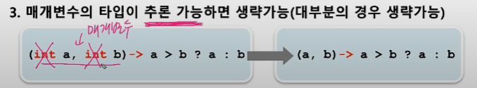

   

## 14-3 람다식 작성하기 - 주의사항

1. 매개변수가 하나인 경우, 괄호() 생략 가능 ( but 타입이 없을 때만!!!)

   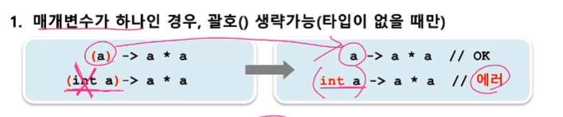

   

2. 블록 안의 문장이 하나뿐일 때, 괄호 {} 생략 가능!!

   단, 하나뿐인 문장이 return 문이면 괄호{} 생략 불가

   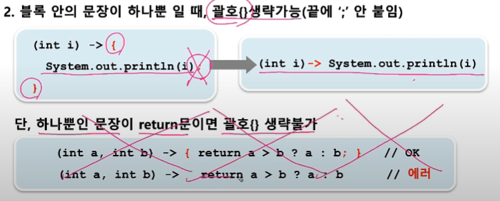

   근데 return 쓸 일이 거의 없으니 그냥 보기만 하라고 하심

   

## 14-3 람다식의 예

| 메서드                                                       | 람다식                                                       |
| ------------------------------------------------------------ | ------------------------------------------------------------ |
| int max(int a, int b) {<br />     return a>b ? a: b<br />}   | (a, b) -> a > b ? a : b                                      |
| int printVar(String name, int i) {<br />     System.out.println(name + "=" + i)<br />} | (String name, int i) -> System.out.println(name + "=" + i) 라고 생각을 했으나...<br />(name, i) -> System.out.println(name + "=" + i) 이렇게 생략이 가능 |
| int square(int x) {<br />     return x * x<br />}            | x -> x * x                                                   |
| int roll() {<br />     return (int)(Math.random() * 6)<br />} | () -> (int)(Math.random() * 6)                               |


## 14-4 람다식은 익명 함수? 사실은 익명 객체!

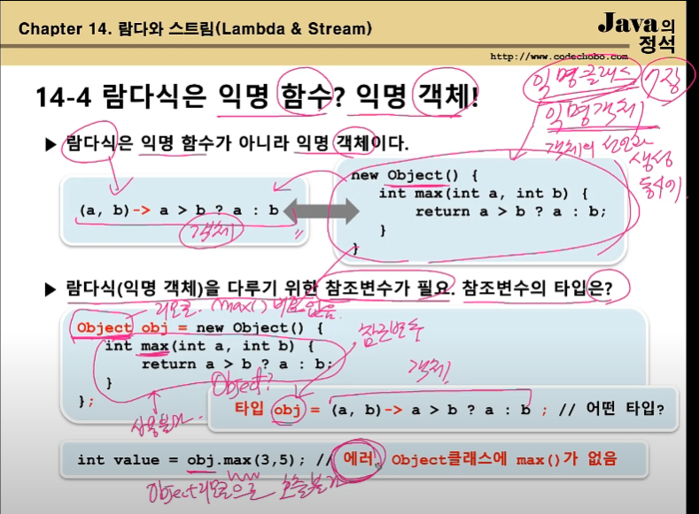

- 람다식은 사실 익명 함수가 아니라 익명 객체이다.

  `자바 에서는 메서드만 따로 존재할 수가 없으니까!!`

  

- 람다식(익명 객체)을 다루기 위한 참조변수가 필요. 참조 변수의 타입은?

  Object 이다! 익명 객체는 Object 타입이니까


- 근데 그러면 위의 그림처럼 문제가 하나 생긴다.

  참조변수 타입은 Object 로 하는게 맞다. new Object() 를 가르켜야 하니까

  근데 Object 타입 참조 변수로는 max() 를 쓸 수 없다. 이에 대한 해결책이 필요함

  그걸 14-5 에서 알랴줄꺼!


## 14-5 함수형 인터페이스

- 함수형 인터페이스 - 단 하나의 추상 메서드만 선언된 인터페이스

  ```java
  @FunctionalInterface		
  interface MyFunction {
      public abstract int max(int a, int b);
  //   public abstract int max2(int a, int b);		이게 불가능해짐!
  }
  
  MyFunction f = new MyFunction(){
      public int max(int a, int b){
          return a > b ? a : b;
      }
  }
  
  int value = f.max(3,5);
  
  ```

  @FunctionInterface 를 붙이게 되면, 추상 메서드를 1 개만 들어올 수 있게 컴파일러가 잡아줌!


- 함수형 인터페이스 타입의 참조변수로 람다식을 참조할 수 있음.

  `(단, 함수형 인터페이스의 메서드와 람다식의 매개변수 개수와 return 타입이 일치해야 한다)`

  ```java
  MyFunction f = (a,b) -> a > b ? a : b;	// 람다식. 익명객체
  int value = f.max(3,5);
  ```

  

- 참조) Ex14_0 


## 14-5 함수형 인터페이스 - example

- 익명 객체를 람다식으로 대체

  ```java
  List<String> list = Arrays.asList("abc", "aaa", "bbb", "ddd", "aaa");
  
  Collections.sort(list, new Comparator<String>(){
      public int compare(String s1, String s2){
          return s2.compareTo(s1);
      }
  })
  ```

  지금까지는 list 에 sort 를 쓰려면 위와 같이 바로 Comparator 객체를 생성해서 집어넣어야 했다.

  하지만 Comparator 는 코드상 다음과 같이 구현되어 있다.

  ```java
  @FunctionalInterface			// 이 부분을 얘기하고 싶은 거임
  interface Comparator<T> {
      public abstarct compare(T o1, T o2);
  }
  ```

  그래서 다음과 람다식을 이용하면 다음과 같이 나타낼 수 있다

  ```java
  List<String> list = Arrays.asList("abc", "aaa", "bbb", "ddd", "aaa");
  
  Collections.sort(list, (s1, s2) -> s2.compareTo(s1));
  ```

  

## 14-6 함수형 인터페이스 타입의 매개변수, 반환타입

- 함수형 인터페이스 타입의 매개변수 

  ```java
  @FunctinalInterface
  interface MyFunction {
      public abstarct void myMethod();
  }
  
  void aMethod(MyFunction f) {	//
      f.myMethod();	// MyFunction 에 정의된 메서드 호출 == 람다식 호출
  }
  
  MyFunction f =  () -> System.out.println("myMethod()");		
  aMethod(f);	// 이렇게 써도 되고
  
  aMethod(() -> System.out.println("myMethod()"));
  ```

  

- 함수형 인터페이스 타입의 return 타입

  ```java
  MyFunction myMethod() {
      MyFunction f = () -> {};
      return f;
  }
  
  MyFunction myMethod() {
      return () -> {};
  }
  ```

  

- 참조) Ex14_1


## 14-7 java.util.function 패키지 (1/3)

- 자주 사용되는 다양한 함수형 인터페이스를 제공

  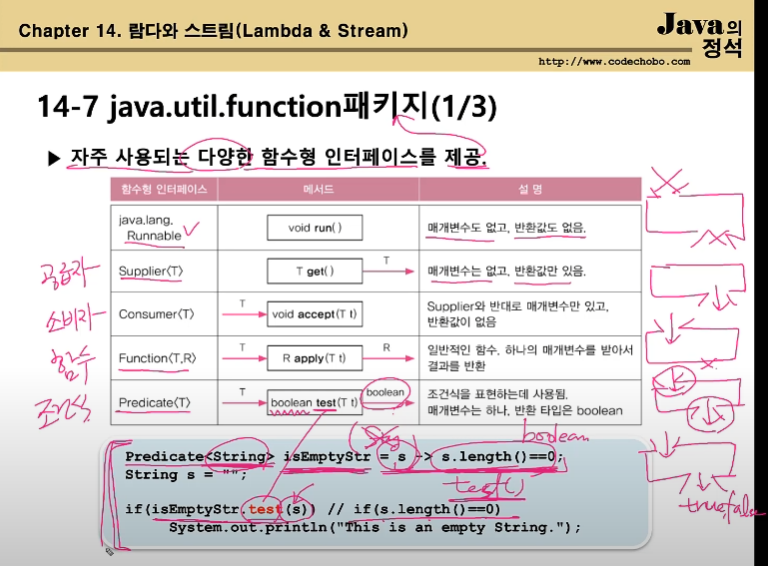

  마지막은 Predicate 인터페이스의 예시를 보여준 것.

  

- 퀴즈

  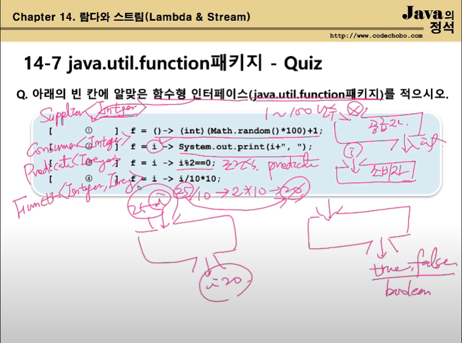

  

## 14-7 java.util.function 패키지 (2/3)

- 매개변수가 2개인 함수형 인터페이스

  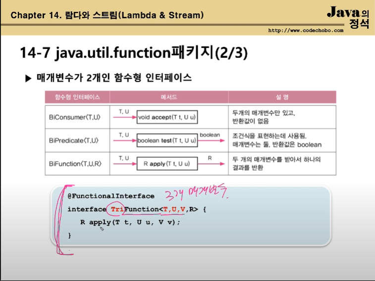

  매개변수가 3개인 경우네느 따로 선언을 해야함


## 14-7 java.util.function 패키지 (3/3)

- 매개변수의 타입과 반환타입이 일치하는 함수형 인터페이스

  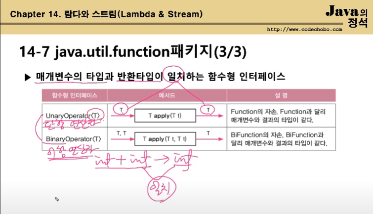

  

- UnaryOperator<T> 구현 된거

  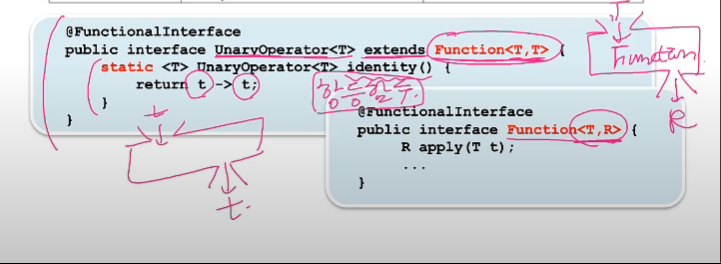


- 참조)Ex14_2


## 14-9 Predicate 의 결합

- and(), or(), negate() 로 두 Predicate 를하나로 결합 `default 메서드`

  원래는 추상메서드 1 개 밖에 없다. 

  하지만 인터페이스는 static 메서드, default 메서드들도 추가가 가능함

  ```java
  Predicate<Integer> p = i -> i < 100;
  Predicate<Integer> q = i -> i < 200;
  Predicate<Integer> r = i -> i % 2 == 0;
  
  Predicate<Integer> notP = p.negate();			i >= 100
  Predicate<Integer> all = notP.and(q).or(r);		 100 <= i && i < 200 || i % 2 == 0
  Predicate<Integer> all2 = notP.and(q.or(r));	 100 <= i %% ( i < 200 || i % 2 == 0 )
  ```

  ```java
  System.out.println(all.test(2));		// 이게 왜 true?
  System.out.println(all2.test(2));		// 이게 왜 false?
  ```

  

- 등가비교를 위한 Predicate의 작성에는 isEqual() 를 사용 `static 메서드`

  ```java
  Predicate<String> p = Predicate.isEqual(str1)		isEqual() 은 static 메서드
  Boolean result = p.test(str2);						 str1 과 str2 가 같은 지 비교한 결과를 반환
  
  boolean result = Predicate.isEqual(str1).test(str2);
  ```

  근데 이거는 안 외워도 되고, 그냥 필요할 때 보고 하자

  

- 참조) Ex14_4

  

## 14-11 컬렉션 프레임웍과 함수형 인터페이스

- 함수형 인터페이스를 사용하는 컬렉션 프레임웍의 메서드 ( 와일드 카드 생략 )

  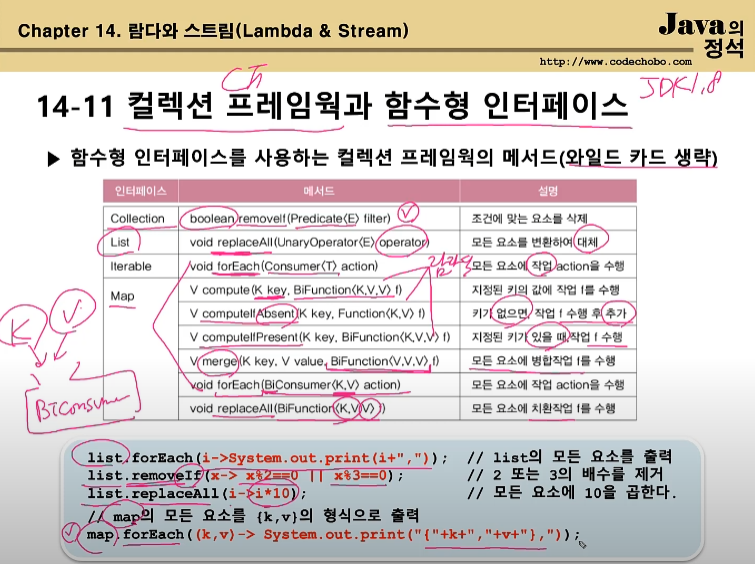

  

- 참조) Ex14_4


## 14-13 메서드 참조 (method reference)

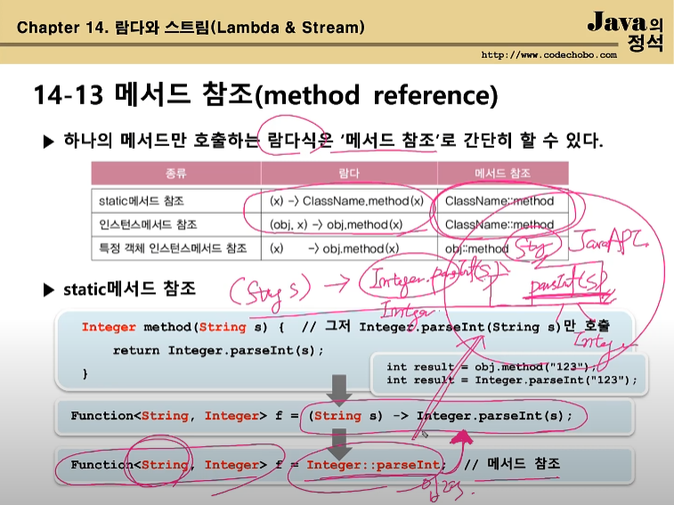

- `클래스이름::메서드이름` 

- 하나의 메서드만 호출하는 람다식은 `메서드 참조` 로 `더 간단히 할 수 있다`

  ​	

- static 메서드 참조

  만약 메서드 참조가 이해가지 않는 다면, 

  역으로 람다식으로 바꿔서 이해해보려고 하자


- 다 외울 필요 없다! 

  책 보면서 할 수 있으면 충분함!


- 참조) Ex14_0_0 


## 14-14 생성자의 메서드 참조

- 생성자와 메서드 참조

  ```java
  Supplier<MyClass> s = () -> new MyClass();
  
  Suppler<MyClass> s = MyClass::new;
  ```

  

  이거 보면 생성자에 매개변수가 필요한 경우이다

  ```java
  Function<Integer, MyClass> s = i -> new MyClass(i);	
  
  Function<Integer, MyClass> s = MyClass::new;
  ```

  결과는 위에와 같다. 

  다만 이 경우 함수형 인터페이스는 Function, 즉 input 이 존재한다.

  

  그래서 이런 경우, Integer 타입 변수 하나가 생성자의 매개변수로 들어간다는 얘기이다!

  만약 2 개의 매개변수가 필요하면, BiFunction 인터페이스를 사용하면 됨!

  

- 배열과 메서드 참조

  ```java
  Function<Integer, int[]> f = x -> new int[x];			람다식
  
  Function<Integer, int[]> f2 = int[]::new;
  ```

  

- 참조) Ex14_0_1

  

## 14-15 스트림(Stream)

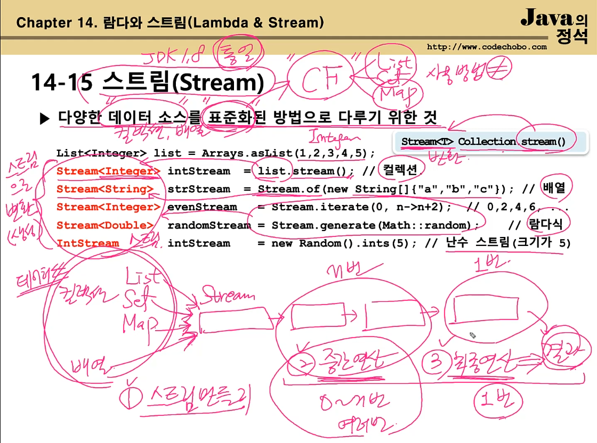

- `다양한 데이터 소스==컬렉션, 배열`를 표준화된 방법으로 다루기 위한 것

  

- 스트림을 사용하는 것은 크게 3 가지의 과정으로 볼 수 있다.

  1. 스트림 생성
  2. 중간연산 ( 0 ~ n 번 )
  3. 최종연산 ( 0 ~ 1 번 )

  

- 스트림 과정 예시

  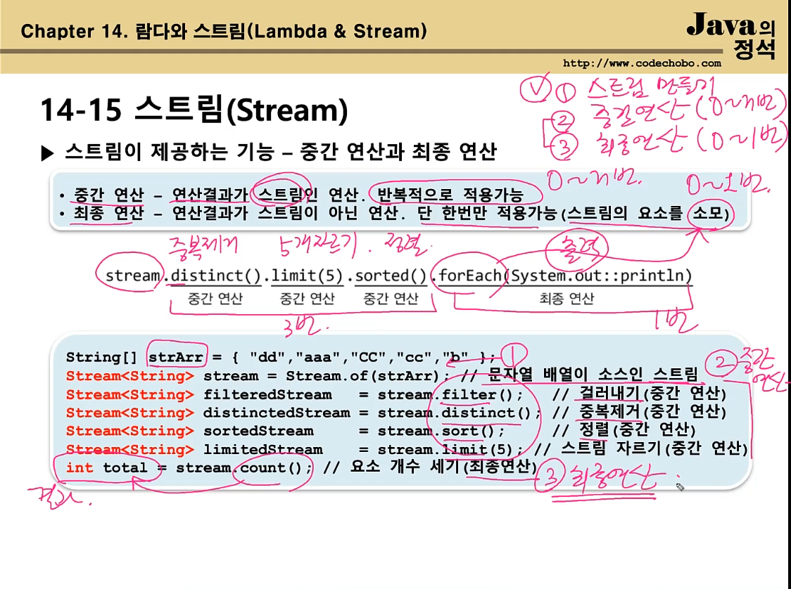

  

## 14-16 스트림(Stream) 의 특징 (1/3)

- 밑에 나오는 세부적인 코드 부분은 아직 몰라도 된다! 그냥 흐름만 이해하자!

  

- 스트림은 데이터 소스로부터 데이터를 읽기만할 뿐 변경하지는 않는 다!

  ```java
  List<Integer> list = Arrays.asList(3,1,5,4,2);
  List<Integer> sortedList = list.stream().sorted()			list 를 정렬
      					.collect(Collectors.toList());		   새로운 List 에 저장
  System.out.println(list);									  [3, 1, 5, 4, 2]
  System.out.println(sortedList);								 [1, 2, 3, 4, 5]
  ```

  

- 스트림은 Iterator 처럼 일회용이다. 따라서 필요하면 다시 스트림을 생성해야 한다.

  ```java
  strStream.forEach(System.out::println);				모든 요소를 화면에 출력 (최종연산)
  int numOfStr = strStream.count();				   에러. 스트림이 이미 닫혔음.
  ```

  

- 최종 연산 전까지 중간연산이 수행되지 않는 다. - 지연된 연산

  ```java
  IntStream intStream = new Random().ints(1, 46);			 1~45 범위의 무한 스트림
  intStream.distinct().limit(6).sorted()						   중간 연산
  		.forEach(i -> System.out.print( i + ", "));			   최종 연산
  ```

  스트림의 종류에는 크게 2 가지이다.

  1. 유한 스트림
  2. 무한 스트림

  위의 코드에서 intStream 은 무한 스트림인데, 중복 제거+정렬을 실행함.

  이건 말이 안되지만, 컴파일러는 에러를 잡아내지 않는 다.

  

  왜냐하면, 스트림은 최종 연산을 하지 않으면 

  중간 연산을 표시만 해뒀다가, 나중에 필요할 때 실행을 하기 때문이다!


## 14-16 스트림(stream) 의 특징 (2/3)

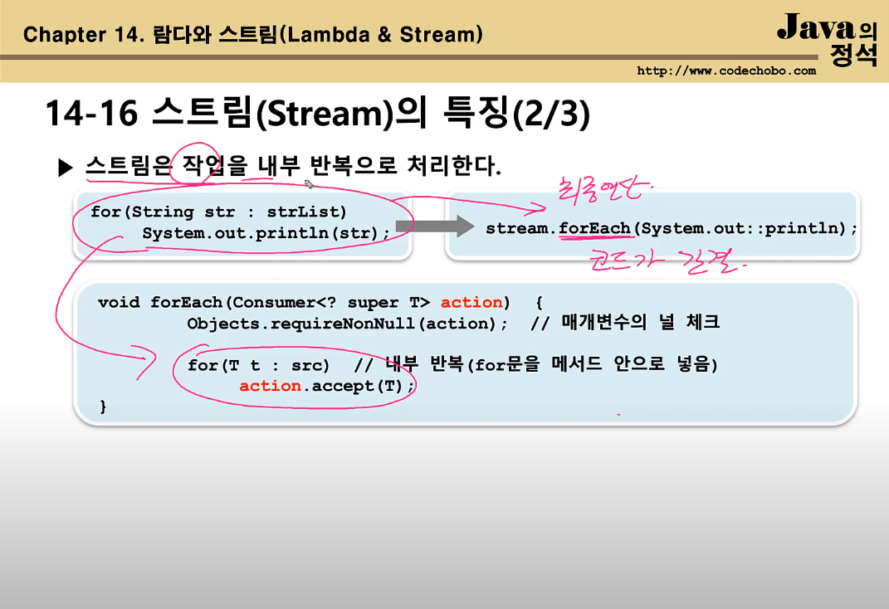

반복문으로 한번 하면 될걸

위처럼 구현하게 되면 성능이 떨어지게 된다.


하지만 이처럼 해두면, 코드를 쓸 때 간결해진다는

장점이 있다!


## 14-16 스트림(stream) 의 특징 (3/3)

- 스트림의 작업을 병렬로 처리 - 병렬스트림 ( 멀티쓰레드! )

  ```java
  Stream<String> strStream = Stream.of("dd", "aaa", "CC", "cc", "b");
  int sum = strStream.parallel()			// 병렬 스트림으로 전환함 (속성만 변경)
      				.mapToInt(s -> s.length()).sum();			// 모든 문자열의 길이의 합
  ```

  병렬스트림을 다시 되돌려 놓고 싶으면

  sequential()!

  

- 기본형 스트림 - IntStream, LongStream, DoubleStream

  1. 오토방식 & 언박싱 의 비효율이 제거됨 (Strean<Integer> 보다 IntStream) 사용

  2. 숫자와 관련된 유용한 메서드를 Stream<T> 보다 더 많이 제공

  3. 근데 기본형 스트림 은 1 번만 잘 알고, 쓸 일은 거의 없다고 하심

     만약 성능이 너무 느리다 싶으면, 그때 기본형 스트림을 고려해보라고 함.

## 14-17 스트림 만들기 -컬렉션


- Collection 인터페이스의 stream()으로 컬렉션을 스트림으로 변환

  ```java
  Stream<E> stream()	// Collection 인터페이스의 메서드
  ```

  Collection 인터페이스를 구현한 List, Set 이 위의 메서드를 가지고 있을 것이다!

  ```java
  List<Integer> list = Arrays.asList(1,2,3,4,5);
  Stream<Integer> intStream = list.stream();	// list 를 스트림으로 변환
  
  // 스트림의 모든 요소 출력하기
  intStream.forEach(System.out::print);	//12345
  intStream.forEach(i -> System.out.print(i));	// 위의 코드를 람다식으로 대체함. 근데 이건 에러임. 왜냐하면 stream 은 forEach 라는 최종연산 때문에 이미 닫혔으니까!
  intStream.forEach(System.out.print(i));				// 위의 동일한 이유로 에러!
  ```

참조) Ex14_0_3


## 14-18 스트림 만들기 - 배열

- 객체 배열로부터 스트림 생성하기

  ```java
  Stream<T> Stream.of(T... values);	// 가변 인자
  Stream<T> Stream.of(T[]);
  Stream<T> Arrays.stream(T[]);
  Stream<T> Arrays.stream(T[] array, int startInclusive, int endExclusive);
  ```

  예시

  ```java
  Stream<String> strStream = Stream.of("A", "B", "C");	// 가변 인자
  Stream<String> strStream = Stream.of(new String[]{"A", "B", "C"});
  Stream<String> strStream = Arrays.stream(new String[]{"A", "B", "C"});
  Stream<String> strStream = Arrays.stream(new String[]{"A", "B", "C"}, 0, 3);
  ```

​	

- 기본형 배열로부터 스트림 생성하기

  ```java
  IntStream IntStream.of(int... values);	// 가변 인자
  IntStream IntStream.of(int[]);
  IntSteram Arrays.stream(int[]);
  IntStream Arrays.stream(int[], int startInclusive, int endExclusive);
  ```

​	

- 주의1

  ```java
  Stream<String> strStream = Stream.of({"A","B","C"}); 
  ```

  이건 안된다! 무조건 `new String[]{"A","B","C"} 라고 해야 한다!

- 주의2
  Stream<Integer> 와 IntStream 의 차이는 뭐냐?
  메서드 갯수의 차이가 있다!
  Stream 은 객체 스트림이다. 즉, 숫자 외에도 여러 타입의 스트림이 가능해야 하므로, 
  숫자 스트림 에만 사용할 수 있는 sum(), average() 를 넣지 않은 것이다!

  ```java
  int[] intArr={1,2,3,4,5};
  IntStream stream1 = Arrays.stream(intArr);
  IntStream stream2 = Stream.of(intArr);
  System.out.println(stream1.sum());
  ```

- 주의3
  Arrays.stream( ) 과 Stream.of( ) 의 차이는 없다! 편한거 쓰면 된다.
  만약 인자로 int[] 를 넣으면 return 타입이 IntStream 이고,
  Integer[] 를 넣으면 return 타입이 String<Integer> 가 된다!

- 참조) 14_0_0 그대로

  

## 14-19 스트림 만들기 - 임의의 수

- 난수를 요소로 갖는 스트림 생성하기

  ```java
  IntStream intStream = new Random().ints();
  intStream.limit(5).forEach(System.out::println);
  
  IntStream intStream = new Random().ints(5); // 위의 2 코드를 이렇게 한 줄로 줄일 수 있다
  ```

  ```java
  Integer.MIN_VALUE <= ints() <= Integer.MAX_VALUE;
  Long.MIN_VALUE <= long() <= Long.MAX_VALUE;
  0.0 <= doubles() < 1.0;
  ```

  

- 지정된 범위의 난수를 요소로 갖는 스트림을 생성하는 메서드(Random 클래스)

  ```java
  // 무한 스트림
  IntStream ints(int begin, int end);
  LongStream longs(long begin, long end);
  DoubleStream doubles(double begin, double end);
  
  // 유한 스트림
  IntStream ints(long streamSize, int begin, int end);
  LongStream longs(long streamSize, long begin, long end);
  DoubleStream doubles(long streamSize, double begin, double end);
  ```


- 참조) Ex14_0_4


## 14-20 스트림 만들기 - 특정 범위의 정수

- 특정 범위의 정수를 요소로 갖는 스트림 생성하기 (IntStream, LongStream)

  ```java
  IntStream IntStream.range(int begin, int end);
  IntStream IntStream.rangeClosed(int begin, int end);
  ```

  예시

  ```java
  IntStream intStream = IntStream.range(1,5);					// 1,2,3,4
  IntSteram intStream2 = IntStream.rangeClosed(1,5);	// 1,2,3,4,5
  ```

​	

## 14-21 스트림 만들기 - 람다식 iterate(), generate()

- 람다식을 소스로 하는 스트림 생성하기

  ```java
  static <T> Stream<T> iterate(T seed, UnaryOperator<T> f);	// 이전 요소에 종속적
  static <T> Stream<T> generate(Supplier<T> s);							// 이전 요소에 독립적
  ```

  

- Iterate() 는 이전 요소를 seed로 해서 다음 요소를 계산한다.

  ```java
  Stream<Integer> evenStream = Stream.iterate(0, n->n+2);	// 0, 2, 4, 6, ...
  ```

  

- generate( ) 는 seed 를 사용하지 않는 다.

  ```java
  Stream<Double> randomStream = Stream.generate(Math::random);
  Stream<Integer> oneStream = Stream.generate(()->1);
  ```


- 참조) Ex14_0_5


## 14-22 스트림 만들기 - 파일과 빈 스트림

- 파일을 소스로 하는 스트림 생성하기

  ```java
  Stream<Path> Files.list(Path.dir);	// Path 는 파일 또는 디렉토리
  ```

  log 파일이나 다량의 텍스트를 검사할 때 사용한다!

  ```java
  Stream<String> Files.lines(Path path);
  Stream<String> Files.lines(Path path, Charset cs);
  Stream<String> lines()	//	BufferedReader 클래스의 메서드
  ```

  

- 비어있는 스트림 생성하기

  ```java
  Stream emptyStream = Stream.empty();
  long count = emptyStream.count();	// 0
  ```


- 이런 것들이 있다고만 알고 있자!

-----

**이 전까지는 `스트림 만들기` 였다
이제부터는 그 이후의 단계인 중간 연산과 최종 연산을 배운다.**

## 14-23 스트림의 연산


이 장에서는 딱 이것들만 언급하고 넘어감.

중간 연산의 return 값은 Stream 이기에 저렇게 chaining 이 가능하다.

최종 연산은 한번 하면 닫히게 된다!


## 14-24 스트림의 연산 - 중간 연산


대부분 전에 쓰던 거랑 비슷하다.

skip(3).limit(5) : 요소 3개 건너 뛴 다음에 5개를 가져옴.

peek( ) : forEach() 랑 비슷함. 보통 그 전까지의 작업들이 잘 수행됐는 지 체크할 때 사용한다.

핵심은 map, flatMap 이다. 나중에 배울 것!


## 14-25 스트림의 연산 - 최종 연산


제일 중요한 건 reduce() 라고 했고

이번에도 언급만 했다!


## 14-26 중간연산(1/7)

- 스트림 자르기 - skip( ), limit( )

  ```java
  Stream<T> skip(long n);
  Stream<T> limit(long maxSize);
  ```

- 예시

  ```java
  IntStream intStream = IntStream.rangeClosed(1,10);
  intStream.skip(3).limit(5).forEach(System.out::print);	//45678
  ```


## 14-27 중간연산(2/7)

- 스트림의 요소 걸러내기 - filter( ), distinct( )

  ```java
  Stream<T> filter(Predicate<? super T> predicate);
  Stream<T> distinct();
  ```

- 예시

  ```java
  IntStream intStream = IntStream.of(1,2,2,3,3,3,4,5,5,6);
  intStream.distinct().forEach(System.out::print);
  
  IntStream intStream = IntStream.rangeClose(1,10);
  // case1
  intStream.filter(i -> i%2 == 0).forEach(System.out::print);	// 246810
  
  // case2
  intStream.filter(i -> i % 2 != 0).filter(i -> i % 3 != 0).forEach(System.out::print);	//157
  ```


## 14-28 스트림의 중간연산(3/7)

- 스트림 정렬하기 - sorted( )

  ```java
  Stream<T> sorted();												// 스트림 요소의 기본 정렬(Comparable) 로 정렬
  Stream<T> sorted(Comparator<? super T> comparator);		// 지정된 Comparator 로 정렬
  ```

  원래 정렬 할 때 필요한 건 2 가지가 있다.

  1. 정렬 대상
  2. 정렬 기준

  그래서 위의 comparator 를 줘야 하는 데, 만약 안 주면 

  stream 요소가 구현한 comparable 로 정렬을 시행함

  

  

## 14-29 스트림의 중간연산(4/7)


## 14-30 스트림의 중간연산(5/7)

이 전까지 배운 중간연산들은 다음과 같다.

skip(),  limit(), distinct(), filter(), sorted() 이 3가지이다!


앞으로 배울 것은 

`map() : stream 요소 변환`

`peek() : forEach() 와 비슷함`

`flatmap() : 차원을 변환해준다? 이게 ㅅㅂ 뭔소리야`


- 스트림의 요소 변환하기 - map()

  ```java
  Stream<R> map(Function<? super T, ? extends R> mapper); // Stream<T> -> Stream<R>
  ```

  ```java
  Stream<File> fileStream = Steram.of(
      new File("Ex1.java"), 
      new File("Ex1"), 
      new File("Ex1.bak"), 
      new File("Ex2.java"), 
      new File("Ex1.txt")
  );
  
  Stream<String> filenameStream = fileStream.map(File::getName);
  // 아님
  Stream<String> filenameStream = fileStream.map((File f) -> f.getName());
  filenameStream.forEach(System.out::println);
  ```


- Ex) 파일 스트림(Stream<File> ) 에서 파일 확장자(대문자)를 중복없이 뽑아내기 

  ```java
  fileStream.map(File::getName)
    .filter(s->s.indexOf('.')!=-1)
    .map(s->s.subString(s.indexOf('.')+1))
    .map(String::toUpperCase)
    .distinct()
    .forEach(System.out::println);		
  //JAVA
  //BAK
  //TXT
  ```


- 참조) Ex14_6


## 14-32 스트림의 중간연산(6/7)

- 스트림의 요소를 소비하지 않고 엿보기 - peek( )

  ```java
  Stream<T> peek(Consumer<? super T> action);		  //중간연산(스트림을 소비 x)
  void			forEach(Consumer<? super T> action);	//최조 연산(스트림 요소를 한 개씩 소비 o)
  ```

  주로 디버깅 용도로 많이 사용한다!

  ```java
  fileStream.map(File::getName)		// Stream<File> -> Stream<String>
    .filter(s->s.contains('.'))
    .peek(s->System.out.printf("filename = %s%n", s))
    .map(s->s.subString(s.indexOf('.')+1))
    .peek(s->s.System.out.printf("extension = %s%n", s))
    .forEach(System.out::println);
  ```


- 참조) Ex14_6

  

## 14-33 스트림의 중간연산(7/7)


tlqkf 뭔 소리야

- map 이나 filter 같은 거 쓰면, 리턴값이 Stream 이기 때문에,

  잘못하면 Stream<Stream<String>> 같은 꼬라지가 나온다.

  

- 바로 위의 설명이 잘못 되어있다. 하도 심신미약상태에서 적어서 그런듯?

  왜냐하면, map 은 요소 하나하나를 변경하는 거지, 

  map 을 쓰는 것 만으로 그 요소를 stream 으로 변경하지 못함

  

  이번 단원에서 flatmap 을 사용했던 이유는

  String[] 을 2 개 가지고 있는 Stream 을, 

  1 개의 String[] 안에 기존의 2 개의 String[] 의 요소들을

  다 박아서 새로운 Stream 으로 만들 때 필요한 게

  flatmap 이라는 거다.

  

- 참조) Ex14_7


## 14-35 Optional<T>

- T 타입 객체의 래퍼클래스 - Optional<T>

  `이는 null 을 간접적으로 다루기 위함이다!`

  ```java
  public final class Optional<T> {
      private final T value;		// T 타입의 참조변수
      
  }
  ```

  다음과 같은 이유들로 Optional 을 사용한다.

  1. null 을 직접 다루는 것은 위험하다 (NullPointerException 때문!)

     다음과 같은 코드가 있다고 해보자

     ```java
     Object result = getResult();
     ```

     이때 반환 값은 둘 중 하나이다

     - 객체
     - null

     null 일 때 result.toString() 을 해버리게 된다면, NullPointerException 이 발생하게 된다!

     

  2. null 체크하는 코드를 없애 코드를 깔끔하게 한다.

     ```java
     if(result != null)
         println(result.toString());
     ```

     우리는 항상 어떤 참조 변수를 가져다 쓸 때

     null 인지 아닌지를 체크해야 한다. 

     

     하지만 Optional<T> 를 사용하게 된다면 

     이렇게 코드를 지저분하게 안 써도 된다!


## 14-36 Optional<T> 객체 사용하기

- Optional<T> 객체를 생성하는 다양한 방법

  ```java
  String str = "abc";
  Optional<String> optVal = Optional.of(str);
  Optional<String> optVal = Optional.of("abc");
  Optional<String> optVal = Optional.of(null):			// NullPointerException 발생.
  Optional<String> optVal = Optional.ofNullable(null);	//ok. 
  ```

  Optional.of() 로 Optional 객체를 생성하지만

  Optional 은 null 을 간접적으로 다루기 위한 것이니

  사실상 ofNullable() 을 더 많이 사용할 것이다.

  

- null 대신 빈 Optional<T> 객체를 사용하자

  ```java
  Optional<String> optVal = null;		// null 로 초기화. 가능하지만, 바람직하지 않음
  Optional<String> optval = Optional.empty();			// null 로 하기보다, 이렇게 그냥 빈 Optional 객체를 사용해버리기
  ```


## 14-37 Optional<T> 객체의 값 가져오기

- Optional 객체의 값 가져오기 - get(), orElse(), orElseGet(), orElseThrow()

  ```java
  Optional<String> optVal = Optional.of("abc");
  String str1 = optVal.get();							// optVal 에 저장된 값을 반환. 만약 값이 null 이면 예외발생 -> 고로 안씀, 쓰레기임
  String str2 = optVal.orElse("");				   // optVal 에 저장된 값이 null 일때는 매개변수로 주어진 값을 반환 (이 경우 "")
  String str3 = optVal.orElseGet(String::new);	 // orElse 에다가 람다식을 넣고 싶을 때 이러한 메서드를 사용
  String str4 = optVal.orElseThrow(NullPointerException::new);	// null 인 경우 에러를 지정해서 날리기가 가능함
  ```

  

- isPresent() - Optional 객체의 값이 null 이면 false, 아니면 true 를 반환

  ```java
  if(Optional.ofNullable(str).isPresent()){
      System.out.println(str);
  }
  ```

  근데 위의 코드를 간략화 시킨 메서드도 존재함

  ```java
  // ifPresent(Consumer) - null 이 아닐 때 주어진 Consumer 를 실행시킴
  Optional.ofNullable(str).ifPresent(System.out::println);
  ```

  

- 참조) Ex14_0_8


## 14-38 OptionalInt, OptionalLong, OptionalDouble

- 기본형 값을 감싸는 래퍼클래스

  이걸 쓰는 이유는 Optional<T> 보다 성능을 더 높이기 위함이다!

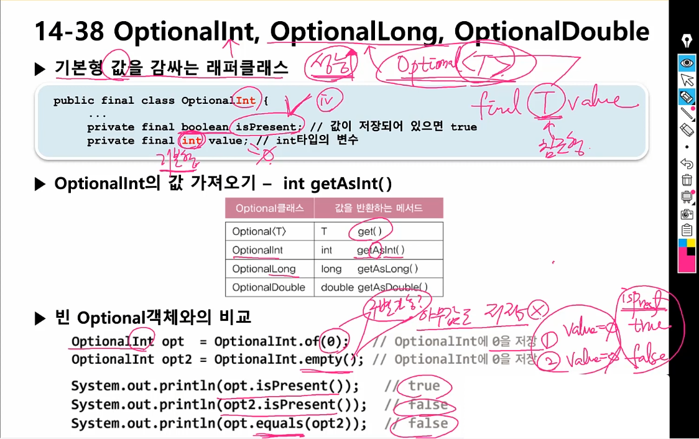


- 참조) Ex14_8


## 14-40 스트림의 최종연산 - forEach

Stream 의

1. 중간 연산
   - 최대 n 번 가능
   - `return 값이 stream 이다!`
   - ex) limit(), skip(), filter(), distinct(), map(), flatMap(), peek()
2. 최종 연산
   - 최대 1 번 가능
   - `얘는 스트림의 요소를 소모함 -> 다 소모하고 나면 스트림이 닫히게 된다.`
   - forEach(), allMatch(), anyMatch(), noneMatch(), findFirst(), findAny(), `reduce()`, collect()


- `Stream의 모든 요소에 지정된 작업을 수행` - forEach(), forEachOrdered()

  ```java
  void forEach(Consumer<? super T> action);
  void forEachOrdered(Consumer<? super T> action);
  ```

  ```java
  IntStream.range(1,10).sequential().forEach(System.out::print);			 // 123456789
  IntStream.range(1,10).sequential().forEachOrdered(System.out::print);	// 123456789
  ```

  ```java
  IntStream.range(1,10).parallel().forEach(System.out::print);				// 683295714
  IntStream.range(1,10).parallel().forEachOrdered(System.out::print);		  // 123456789
  ```

  

- `조건 검사 - allMatch(), anyMatch(), noneMatch()`

  ```java
  boolean allMatch(Predicate<? super T> predicate);		 // 모든 요소가 조건을 만족시키면 true
  boolean anyMatch(Predicate<? super T> predicate);		// 한 요소라도 조건을 만족시키면 true
  boolean noneMatch(Predicate<? super T> predicate);		// 모든 요소가 조건을 만족시키지 않으면 true
  ```

  ```java
  boolean hasFailedStu = stuStream.anyMatch(s -> s.getTotalScore() <= 100);		// 100점 이하인 낙제자가 있는 지
  ```

  

- `조건에 일치하는 요소 찾기 - findFirst(), findAny()`

  ```java
  Optional<T> findFirst();		// 첫 번째 요소를 반환함. 순차 스트림에 사용
  Optional<T> findAny();		   // 아무거나 하나를 반환함. 병렬 스트림에 사용
  ```

  ```java
  Optional<Student> result = stuStream.filter(s -> s.getTotalScore() <= 100).findFirst();
  Optional<Student> result = parallelStream.filter(s -> s.getTotalScore() <= 100).findAny();
  ```

  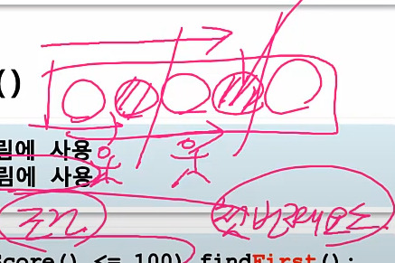

- 이 사진이 순차 스트림과 병렬 스트림에서 findFirst(), findAny() 가 작동하는 것이다!


## 14-42, 43 스트림의 최종연산 - reduce()

- stream 의 요소를 하나씩 줄여가며 누적연산 수행 (accumulator) - reduce()

  ```java
  Optional<T> reduce(BinaryOperator<T> accumulator);					// identity 가 없으면 
  T			 reduce(T identity, BinaryOperator<T> accumulator);
  U			 reduce()
  ```

  - identity - 초기값
  - accumulator - 이전 연산결과와 stream의 요소에 `수행할 연산`
  - combiner - 병렬처리된 결과를 합치는 데 사용할 연산 (병렬 스트림) --> 이건 나중에 하라고 하심

  ```java
  // int reduce(int identity, IntBinaryOperator op)
  int count 	= intStream.reduce(0, (a,b) -> a + 1);									     // count() 
  int sum 	= intStream.reduce(0, (a,b) -> a + b);			  							// sum()
  int max 	= intStream.reduce(Integer.MIN_VALUE, (a, b) -> a > b ? a : b);			//  max()
  int min		= intStream.reduce(Integer.MAX_VALUE, (a, b) -> a < b ? a : b);			//  min()
  ```

  이것들은 reduce 로 기존의 최종연산들을 구현한 것이다. 

  근데 실제로 count(), sum(), max(), min() 들은 reudce() 로 구현이 되어 있음.

  

  그리고 실제 reduce() 의 동작 과정을 보면 다음과 비슷함

  ```java
  int a = identity;			// 이 자리에 identity 가 들어감
  
  for(int b : stream)
      a = a + b ; 			// 이 자리에 accumulator 가 들어감
  ```

  

  
