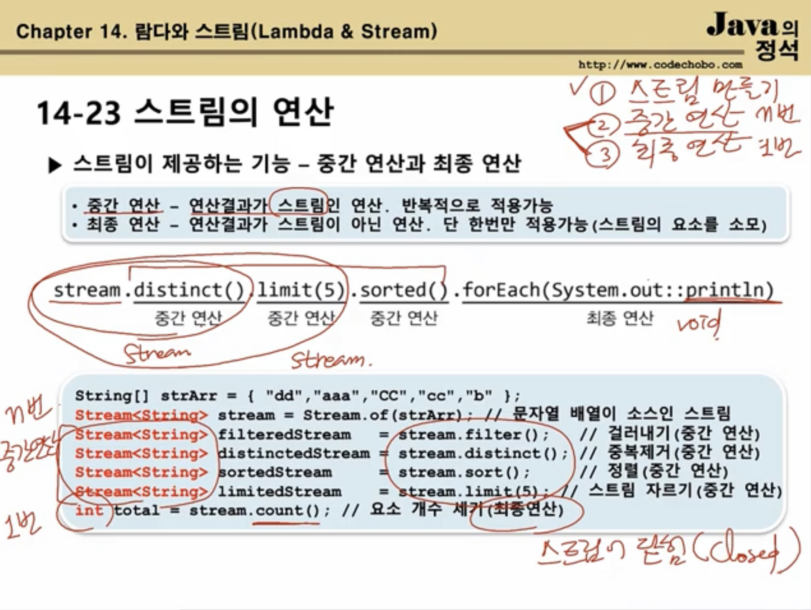

**스트림으로 작업하는 데에는 3 단계가 있다.**

1. **스트림 만들기**
2. **중간 연산( 0~n )**
3. **최종 연산( 0~1 )**

**이 장에서는 스트림 만들기를 배울 것이다!**

## 14-17 스트림 만들기 -컬렉션


- Collection 인터페이스의 stream()으로 컬렉션을 스트림으로 변환

  ```java
  Stream<E> stream()	// Collection 인터페이스의 메서드
  ```

  Collection 인터페이스를 구현한 List, Set 이 위의 메서드를 가지고 있을 것이다!

  ```java
  List<Integer> list = Arrays.asList(1,2,3,4,5);
  Stream<Integer> intStream = list.stream();	// list 를 스트림으로 변환
  
  // 스트림의 모든 요소 출력하기
  intStream.forEach(System.out::print);	//12345
  intStream.forEach(i -> System.out.print(i));	// 위의 코드를 람다식으로 대체함. 근데 이건 에러임. 왜냐하면 stream 은 forEach 라는 최종연산 때문에 이미 닫혔으니까!
  intStream.forEach(System.out.print(i));				// 위의 동일한 이유로 에러!
  ```

참조) Ex14_0_3


## 14-18 스트림 만들기 - 배열

- 객체 배열로부터 스트림 생성하기

  ```java
  Stream<T> Stream.of(T... values);	// 가변 인자
  Stream<T> Stream.of(T[]);
  Stream<T> Arrays.stream(T[]);
  Stream<T> Arrays.stream(T[] array, int startInclusive, int endExclusive);
  ```

  예시

  ```java
  Stream<String> strStream = Stream.of("A", "B", "C");	// 가변 인자
  Stream<String> strStream = Stream.of(new String[]{"A", "B", "C"});
  Stream<String> strStream = Arrays.stream(new String[]{"A", "B", "C"});
  Stream<String> strStream = Arrays.stream(new String[]{"A", "B", "C"}, 0, 3);
  ```

​	

- 기본형 배열로부터 스트림 생성하기

  ```java
  IntStream IntStream.of(int... values);	// 가변 인자
  IntStream IntStream.of(int[]);
  IntSteram Arrays.stream(int[]);
  IntStream Arrays.stream(int[], int startInclusive, int endExclusive);
  ```

​	

- 주의1

  ```java
  Stream<String> strStream = Stream.of({"A","B","C"}); 
  ```

  이건 안된다! 무조건 `new String[]{"A","B","C"} 라고 해야 한다!

- 주의2
  Stream<Integer> 와 IntStream 의 차이는 뭐냐?
  메서드 갯수의 차이가 있다!
  Stream 은 객체 스트림이다. 즉, 숫자 외에도 여러 타입의 스트림이 가능해야 하므로, 
  숫자 스트림 에만 사용할 수 있는 sum(), average() 를 넣지 않은 것이다!

  ```java
  int[] intArr={1,2,3,4,5};
  IntStream stream1 = Arrays.stream(intArr);
  IntStream stream2 = Stream.of(intArr);
  System.out.println(stream1.sum());
  ```

- 주의3
  Arrays.stream( ) 과 Stream.of( ) 의 차이는 없다! 편한거 쓰면 된다.
  만약 인자로 int[] 를 넣으면 return 타입이 IntStream 이고,
  Integer[] 를 넣으면 return 타입이 String<Integer> 가 된다!

- 참조) 14_0_0 그대로

  

## 14-19 스트림 만들기 - 임의의 수

- 난수를 요소로 갖는 스트림 생성하기

   ```java
   IntStream intStream = new Random().ints();
   intStream.limit(5).forEach(System.out::println);
   
   IntStream intStream = new Random().ints(5); // 위의 2 코드를 이렇게 한 줄로 줄일 수 있다
   ```

  ```java
  Integer.MIN_VALUE <= ints() <= Integer.MAX_VALUE;
  Long.MIN_VALUE <= long() <= Long.MAX_VALUE;
  0.0 <= doubles() < 1.0;
  ```

  

- 지정된 범위의 난수를 요소로 갖는 스트림을 생성하는 메서드(Random 클래스)

  ```java
  // 무한 스트림
  IntStream ints(int begin, int end);
  LongStream longs(long begin, long end);
  DoubleStream doubles(double begin, double end);
  
  // 유한 스트림
  IntStream ints(long streamSize, int begin, int end);
  LongStream longs(long streamSize, long begin, long end);
  DoubleStream doubles(long streamSize, double begin, double end);
  ```


- 참조) Ex14_0_4


## 14-20 스트림 만들기 - 특정 범위의 정수

- 특정 범위의 정수를 요소로 갖는 스트림 생성하기 (IntStream, LongStream)

  ```java
  IntStream IntStream.range(int begin, int end);
  IntStream IntStream.rangeClosed(int begin, int end);
  ```

  예시

  ```java
  IntStream intStream = IntStream.range(1,5);					// 1,2,3,4
  IntSteram intStream2 = IntStream.rangeClosed(1,5);	// 1,2,3,4,5
  ```

​	

## 14-21 스트림 만들기 - 람다식 iterate(), generate()

- 람다식을 소스로 하는 스트림 생성하기

  ```java
  static <T> Stream<T> iterate(T seed, UnaryOperator<T> f);	// 이전 요소에 종속적
  static <T> Stream<T> generate(Supplier<T> s);							// 이전 요소에 독립적
  ```

  

- Iterate() 는 이전 요소를 seed로 해서 다음 요소를 계산한다.

  ```java
  Stream<Integer> evenStream = Stream.iterate(0, n->n+2);	// 0, 2, 4, 6, ...
  ```

  

- generate( ) 는 seed 를 사용하지 않는 다.

  ```java
  Stream<Double> randomStream = Stream.generate(Math::random);
  Stream<Integer> oneStream = Stream.generate(()->1);
  ```


- 참조) Ex14_0_5


## 14-22 스트림 만들기 - 파일과 빈 스트림

- 파일을 소스로 하는 스트림 생성하기

  ```java
  Stream<Path> Files.list(Path.dir);	// Path 는 파일 또는 디렉토리
  ```

  log 파일이나 다량의 텍스트를 검사할 때 사용한다!

  ```java
  Stream<String> Files.lines(Path path);
  Stream<String> Files.lines(Path path, Charset cs);
  Stream<String> lines()	//	BufferedReader 클래스의 메서드
  ```

  

- 비어있는 스트림 생성하기

  ```java
  Stream emptyStream = Stream.empty();
  long count = emptyStream.count();	// 0
  ```


- 이런 것들이 있다고만 알고 있자!

-----

**이 전까지는 `스트림 만들기` 였다
이제부터는 그 이후의 단계인 중간 연산과 최종 연산을 배운다.**

## 14-23 스트림의 연산



이 장에서는 딱 이것들만 언급하고 넘어감.

중간 연산의 return 값은 Stream 이기에 저렇게 chaining 이 가능하다.

최종 연산은 한번 하면 닫히게 된다!


## 14-24 스트림의 연산 - 중간 연산


대부분 전에 쓰던 거랑 비슷하다.

skip(3).limit(5) : 요소 3개 건너 뛴 다음에 5개를 가져옴.

peek( ) : forEach() 랑 비슷함. 보통 그 전까지의 작업들이 잘 수행됐는 지 체크할 때 사용한다.

핵심은 map, flatMap 이다. 나중에 배울 것!


## 14-25 스트림의 연산 - 최종 연산


제일 중요한 건 reduce() 라고 했고

이번에도 언급만 했다!


## 14-26 중간연산(1/7)

- 스트림 자르기 - skip( ), limit( )

  ```java
  Stream<T> skip(long n);
  Stream<T> limit(long maxSize);
  ```

- 예시

  ```java
  IntStream intStream = IntStream.rangeClosed(1,10);
  intStream.skip(3).limit(5).forEach(System.out::print);	//45678
  ```


## 14-27 중간연산(2/7)

- 스트림의 요소 걸러내기 - filter( ), distinct( )

  ```java
  Stream<T> filter(Predicate<? super T> predicate);
  Stream<T> distinct();
  ```

- 예시

  ```java
  IntStream intStream = IntStream.of(1,2,2,3,3,3,4,5,5,6);
  intStream.distinct().forEach(System.out::print);
  
  IntStream intStream = IntStream.rangeClose(1,10);
  // case1
  intStream.filter(i -> i%2 == 0).forEach(System.out::print);	// 246810
  
  // case2
  intStream.filter(i -> i % 2 != 0).filter(i -> i % 3 != 0).forEach(System.out::print);	//157
  ```


## 14-28 스트림의 중간연산(3/7)

- 스트림 정렬하기 - sorted();

  ```java
  ```

  