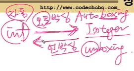

# CH9-1 Object 클래스

Object 클래스란? 
: 모든 클래스의 최고 조상. 오직 11개의 메서드만을 가지고 있다.
: notify(), wait() 등은 쓰레드와 관련된 메서드이다.


- 대부분의 메서드는 오버라이딩해서 우리가 처한 상황에 맞게 사용하게 된다. 

- protected 된 애들은 public 으로 오버라이딩 하여 사용하게 된다.`protected void finalize` 는 객체가 GC 에 의해서 없어질 때 발동하는 메서드이다. 

  메모리가 없으니까 GC 가 작동하는 건데, 이 안에 이상한 작업들을 넣으면은 컴퓨터가 역으로 터지니까, 왼만하면 터치하지 말자.

- getClass() 의 Class 객체는 설계도에 대한 정보를 담은 객체이다. 이걸로 새로운 객체도 만들 수 있고 정보를 얻을 수 있다.

  이 설계도를 가지고 객체 생성, 정보를 얻을 수 있는 것을 `Reflection API` 라고 한다!

  이걸 사용할 줄 알면 정말 다양하게 많아지지만, 난이도가 있기 때문에 자바의 정석 3편에서 나올 예정.

# 9-2 equals(Object obj)

- 객체 자신(this)와 주어진 객체 (obj)를 비교한다. 같으면  true, 다르면 false 를 반환함

- Object 클래스의 equlas()는 객체의 주소를 비교한다. (참조변수 값 비교)

  ```java
  public boolean equals(Object obj){
      return (this==obj);
  }
  ```

  ```java
  class Ex9_1{
      public static void main(String[] args){
          Value v1 = new Value(10);
          Value v2 = new Value(10);
          
          System.out.println(v1.equals(v2))	// false
      }
  }
  
  class Value{
      int value;
      
      Value(int value){
          this.value = value;
      }
  }
  ```

  v1, v2 는 같은 value 를 가지고 있어도, 다른 주소값을 가지고 있다. 이를 true 로 나오게 하려면, equals 를 Overriding 해야한다!

  Ex9-1.java 참조

# 9-3 equals(Object obj) 의 오버라이딩

- 인스턴스 변수(iv) 의 값을 비교핟로고 equals() 를 오버라이딩 해야 한다.

  **상황**

  |        IV        |         CV          |
  | :--------------: | :-----------------: |
  | 객체마다 다른 값 | 객체 끼리 모두 공통 |

  그래서 객체의 iv 값이 다 같으면, equals() 가 true 를 반환하도록 오버라이딩 하기 

  ```java
  class Person{
      long id;
      
      public boolean equals(Object obj){
          if(obj instanceof Person)
              return id == ((Person)obj).id;
          else
              return false;
      }
      
      Person(long id){
          this.id = id;
      }
  }
  ```

  Ex9_2.java 참조

# 9-4 hashCode()

- 객체의 해시코드(hash code) 를 반환하는 메서드
  : 해싱 알고리즘. 나중에 11장 컬렉션 프레임웍에서 배울거

- Object 클래스의 hashCode()는 **객체의 주소를 int 로 변환해서 반환**함.

  ```java
  public class Object{
      //...
      public native int hashCode();	// native 메서드, 내용이 없다!
  }
  ```

  `native` 란 네이티브 메서드, 즉 OS의 메서드이다. 그리고 이는 주로 C 언어로 이루어져 있다.

  그리고 이는 이미 작성된 OS의 메서드를 사용하는 것이기 때문에, 내용이 없다.

  따라서 위처럼 native 라고 해두면, 미리 (C로)작성된 OS 의 메서드가 Java 에서 짜진 메서드처럼 사용이 된다. 그리고 미리 작성된 거니까 내용을 알 수 없다.

- **equals() 를 오버라이딩하면, hashCode()도 오버라이딩 해야 한다.**
  : equals() 의 결과가 true 인 두 객체의 해시코드는 같아야 하기 때문에, hashCode() 도 equals() 에 맞춰서 오버라이딩 해야함. ( 이건 규칙이다!! ) --> Ex9_4.java 에서 배움.

  ```java
  String str1 = new String("ABC");
  String str2 = new STring("ABC");
  System.out.println(str1.equals(str2));	// true, equals() 가 오버라이딩 됐다고 생각하자! 
  System.out.println(str1.hashCode());	// 96354
  System.out.println(str2.hashCode());	// 96354
  ```

  ```java
  public int hashCode(){
      return Objects.hash(매개변수1, 매개변수2, 등등)
  }
  ```

  ​	

- System.identityHashCode(Object obj) 는 Object 클래스의 hashCode() 와 동일.

  ```java
  System.out.println(System.identityHashCode(str1));//3526128
  System.out.println(System.identityHashCdoe(str2));//7699183
  ```

  그리고 32bit JVM 에서는 주소가  int 이다. 하지만 64 bit JVM 에서는 주소 단위가 long 이기 때문에, 64 -> 32 로 바뀌게 되면 단순히 반에서 짤리기 때문에 주소가 같아질 수가 있다! (참고)

# 9-5~6 toString(), toString() 의 오버라이딩

- toString() : 객체(**iv집합**)를 문자열(String)으로 변환하기 위한 메서드

  ```java
  public String toString() {
      return getClass().getName()+"@"+Integer.toHexString(hashCode());
  }
  ```

  getClass() 는 설계도 객체, 
  getName()은 클래스 이름, 
  toHexString() 은 16진수 변환,
  hashCode() 는 주소값  

  ```java
  class Card{
      String kind;
      int number;
      
      Card(){
          this("SPADE", 1);
      }
      
      Card(String kind, int number){
          this.kind = kind;
          this.number = number
      }
      
      public String toString(){
          return "kind : " + kind + " number : " + number;
      }
  }
  
  class Ex9_4{
      public static void main(String[] args){
          System.out.println(new Card().toString());
          System.out.println(new Card().toString());
      }
  }
  ```

  toString 은 객체, 즉 iv의 집합을 String 으로 나타낸다는 정의를 생각하면 위처럼 오버라이딩 하는 게 좀 더 정의와 가깝다.

  남궁성님은 이게 옳은 건 아니지만, 이렇게 하는 게 보통 일반적이라고 하셨다.

  참고) Ex9_4.java

# 9-7 String 클래스

- String 클래스 = 데이터(char[ ], 문자열 배열) + 메서드(문자열 관련)

  ```java
  public final class String implements java.io.Serializable, Comparable {
      private char[] value;
     	~
  }
  ```

- 내용을 변경할 수 없는 불변(immutable, 즉 내용을 변경할 수 없는) 클래스

  ```java
  String a = "a";	// a 주소 0x100
  String b = "b";	// b 주소 0x200
  a = a+b;		// a 주소 0x300 즉 메모리 상에서 계속 새로운 문자열이 생성이 된다.-> 비효율
  ```

- 고로, 덧셈 연산자(+) 를 이용한 문자열 결합은 성능이 떨어짐

  문자열의 결합이나 변경이 잦다면, 내용을 변경가능한 StringBuffer 를 사용
  String 클래스와는 다르게, StringBuffer 는 문자열의 변경이 가능하다!

# 9-8 문자열의 비교

- `String str = "abc";` 와 `String str = String("abc")` 의 차이점? 

  ```java
  String str1 = "abc";//문자열 리터럴 "abc"의 주소가 저장
  String str2 = "abc";//위에서 만들어진 문자열 리터럴 "abc"의 주소가 저장
  String str3 = new String("abc");//새로운 인스턴스
  String str4 = new String("abc");//새로우 인스턴스
  ```

  

  str1 과 str2 는 하나의 문자열 리터럴의 같은 주소를 바라보게 됨.

  하지만 str3 과 str4 는 각각 new 를 통해 객체 생성을 하기 때문에 같은 내용이라도 다른 객체를 바라보게 된다.

  그리고 두 String 의 **내용을 비교**할 때는 equals 를 써야 한다. 왜냐하면 `==` 는 주소값을 비교하기 때문이다. (위의 그림에서 아랫부분을 참고)

# 9-9 문자열 리터럴

- 문자열 리터럴은 프로그램 실행시 자동으로 생성된다.(constant pool에 어장)

  ```java
  class Ex9_7{
      public static void main(String[] args){
          String s1 = "AAA";
          String s2 = "AAA";
          String s3 = "BBB";
          String s4 = "BBB";
      }
  }
  ```

  우리가 만든 문자열은 모두 자동으로 만들어지고, 이는 constant pool(상수 저장소) 에 저장됨.

- 같은 내용의 문자열 리터럴은 하나만 만들어진다.

  

  왜냐하면 String 클래스는 immutable 클래스니까!

# 9-10 빈 문자열("", empty string)

- 내용이 없는 문자열. 크기가 0인 char형 배열을 저장하는 문자열

  `String str = "";`

- 크기가 0 인 배열을 생성하는 것은 어느 타입이나 가능

  ```java
  char[] chArr = new char[0]; // 길이가 0인 char 배열
  int[] iArr = {};			// 길이가 0인 int 배열
  ```

  빈 문자열을 어디다가 쓰냐?

  ```java
  "" + 5 -> "5"; //int -> String
  String str = ""; // null로 초기화하기보단, 이게 더 유용!
  ```

- 문자(char) 와 문자열(String) 의 초기화

  ```java
  String s = null;
  char c = '\u0000'; // 이렇게 하기 보단
  
  String s = "";	// 빈 문자열로 초기화
  char c = '';	// 공백으로 초기화
  ```

  ```java
  String str1 = ""; // 이렇게 선언해야 좋은 코드임
  
  String str2 = new String("");	// 이건 구데기다!
  ```

# 9-11 String 클래스의 생성자와 메서드

|          생성자          | 예제                                                         | 결과        |
| :----------------------: | ------------------------------------------------------------ | ----------- |
|     String(String s)     | String s = new String("Hello");                              | s = "Hello" |
|   String(char[] value)   | char[] c = {'h','e','l','l','o'};<br /><br />String s = new String(c); | c = "hello" |
| String(StringBuffer buf) | StringBuffer sb = new StringBuffer("hello");<br />String s = new String(sb); | s = "hello" |

|                            메서드                            |                             예제                             |              결과               |
| :----------------------------------------------------------: | :----------------------------------------------------------: | :-----------------------------: |
|                    char charAt(int index)                    |       String s = "Hello";<br /> char c = s.charAt(1);        |            c = 'e';             |
|                   int compareTo(String s)                    | int i1 = "aaa".compareTo("bbb");<br />int i2 = "aaa".compareTo("aaa");<br />int i3 = "bbb".compareTo("aaa"); | i1 = -1<br />i2 = 0<br />i3 = 1 |
|                  String concat(String str)                   |        String s1 = "Hello";<br />s1.concat(" World");        |       s1 = "Hello World"        |
| boolean contains(CharSequence s)<br />/ CharSequence interface 를 구현한 모든 클래스들의 인스턴스가 인자로 들어올 수 있다! (다형성!) |   String s = "abcdefg";<br />boolean b= s.contains("bc");    |             b=true              |
|                  booelan endswith(String s)                  | String s = "Hello.txt";<br />boolean b = s.endswith("txt");  |            b = true;            |
|                 boolean equals(Object obj);                  | String s = "Hello";<br />boolean b = s.equals("Hello");<br />boolean b2 = s.equals("hello"); |   b = true;<br />b2 = false;    |
|             boolean equalsIgnoreCase(String str)             | String s = "Hello";<br />boolean b = s.equalsIgnoreCase("heLLo"); |            b = true;            |
| int indexOf(int ch)<br />/매개변수가 int 지만 신경쓰지 말자! | String s = "Hello";<br />boolean b1 = s.indexOf('e');<br />boolean b2 = s.indexOf('c'); |       b1 = 1<br />b2 = -1       |


|                                                              |                             예제                             |                             결과                             |
| :----------------------------------------------------------: | :----------------------------------------------------------: | :----------------------------------------------------------: |
|                 int indexOf(int ch, int pos)                 | String s = "hello";<br />int i1 = s.indexOf(e,0);<br />int i2 = s.indexOf(e,2) |                     i1 = 1<br />i2 = -1                      |
|                   int indexOf(String str)                    |    String s = "ABCDEFG";<br />int idx = s.indexOf("CD");     |                           idx = 2                            |
|                   int lastIndexOf(int ch)                    | String s = "java.lang.Object";<br />int idx1 = s.lastIndexOf('.');<br />int idx2 = s.indexOf('.') |                    idx1 = 9<br />idx2 = 4                    |
|                         int length()                         |      String s = "Hello";<br />int length = s.length();       |                          length = 5                          |
|                 String[] split(String regex)                 | String s = "dog,cat,bear";<br />String[] arr = animals.split(","); |      arr[0]="dog"<br />arr[1]="cat"<br />arr[2]="bear"       |
|           String[] split(String regex, int limit)            | String s = "dog,cat,bear";<br />String[] arr = s.split(",", 2); |             arr[0] = dog<br />arr[1]="cat,bear"              |
| String substring(int begin)<br />String substring(int begin, int end) / begin<= x < end | String s = "java.lang.Object";<br />String c = s.substring(10);<br />String p = s.substring(5, 9); |                  c = "Object"<br />p="lang"                  |
|                     String toLowerCase()                     |    String s = "Hello";<br />String s1 = s.toLowerCase();     |                          s1="hello"                          |
|                     String toUpperCase()                     |     String s ="Hello";<br />String s1 = s.toUpperCase();     |                          s1="HELLO"                          |
|                        String trim();                        |  String s = "   Hello World   ";<br />String s1 = s.trim();  |                      s1 = "Hello World"                      |
| static String valueOf(boolean b)<br />static String valueOf(char c)<br />static String valueOf(int i)<br />static String valueOf(long l)<br />static String valueOf(float f)<br />static String valueOf(double d)<br />static String valueOf(Object o) | String b = String.valueOf(true);<br />String c = String.valueOf('a');<br />String i = String.valueOf(100);<br />String l = String.valueOf(100L);<br />String f = String.valueOf(10F);<br />String d = String.valueOf(10.0);<br />java.util.Date dd = String.valueOf(new java.util.Date()); | b = "true"<br />c = "a"<br />i = "100"<br />l = "100"<br />f = "10"<br />d = "10.0"<br />dd = "Wed Jan 27 21:26 29 KST 2021" |

진짜 개많네

# 9-12 join() 과 StringJoiner

- join( ) 은 여러 문자열 사이에 구분자를 넣어서 결합한다. / join 은 static 메서드이기 때문에 클래스에서 바로 호출함!

  ```java
  .join(구분자, String[] 배열);
  .join(구분자, string1, string2, ...)
  ```

  ```java
  String animals = "dog,cat,bear";
  String[] arr = animals.split(",");
  String str = String.join("-", arr);
  String str = String.join("-", "dog", "cat", "bear");
  String str = String.join("-", new String[]{"dog","cat","bear"});
  System.out.println(str);	// dog-cat-bear
  ```

# 9-13 문자열과 기본형 간의 변환

- 숫자를 문자열로 바꾸는 방법

  ```java
  int i = 100;
  String str1 = i + "";				// "100", 이게 더 편하다
  String str2 = String.valueOf(i);	// "100", 이게 더 성능 굿
  ```

- 문자열을 숫자로 바꾸는 방법

  ```java
  int i = Integer.parseInt("100");		// 100, 이건 좀 올드한 방법
  int i2 = Integer.valueOf("100");		// 100, 이건 좀 새로운 방법. 근데 이게 래퍼클래스마다 다 같으니까, 이걸로 외우자! 
  									// 근데 사실 valueOf 의 반환타입은 Integer, 즉 객체이다. 하지만 반환타입을 int 라고 적어도 된다! 왜냐하면 "오토박싱" 이라는 것이 Integer 객체를 int 로 자동변환 해준다!! (나중에 배울 것)
  Integer i2 = Integer.valueOf("100");// 100
  ```

  ```java
  boolean Boolean.parseBoolean(String s); // 이렇게 하는 게 과거형임.
  ```

  

- `숫자 -> 문자열` 이나, `문자열 -> 숫자` 둘 다 `valueOf` 로 통일된다!

# 9-15~18 StringBuffer 클래스 - 문자열을 저장&다루기

- String 처럼 문자형 배열(char[ ]) 을 내부적으로 가지고 있다.

  ```java
  public final class StringBuffer implements java.io.Serializable {
      private char[] value;
      ~~
  }
  ```

- 그러나, String 는 내용을 불변인거와는 다르게, 내용을 변경할 수 있다. (mutable)

  ```java
  StringBuffer sb = new StringBuffer("abc");	// sb = "abc"
  
  sb.append("123");	// sb = "abc123"
  ```

- 배열은 길이 변경불가. 만약 공간이 부족하게 되면 새로운 배열을 생성해야 함.

  ```java
  int[] arr1 = new int[]{1,2,3,4,5}; // 여기에 하나 추가하려면 새로 만들어야 함. 그래서
  int[] tmp = new int[10];	// 1.선언
  for(int i=0; i < arr1.length; i++){	// 2. 0~4 까지 내용 복사
      tmp[i] = arr[i];
  }
  arr1 = tmp;					// 3. 참조 변경
  ```

- StringBuffer 는 저장할 문자열의 길이를 고려해서 적절한 크기로 생성해야 한다.

  StringBuffer 도 위처럼 공간이 부족하게 되면, 위와 같은 과정을 거쳐야 한다.

  이런 과정을 계속 거치게 되면 프로그램의 성능에 저하를 가져다 주기 때문에, StringBuffer 는3 저장할 문자열의 길이를 고려해서 적절한 크기로 생성해야 한다!

  ```java
  // 실제 StringBuffer 생성자
  public StringBuffer(int length){
      value = new char[length];
      shared = false;
  }
  
  public StringBuffer(){
      this(16);	// 만약 크기를 지정하지 않으면, 크기를 16 으로 정함.
  }
  
  public StringBuffer(String str){
      this(str.length() + 16);	// 주어진 str + 16 이 크기가 된다.
      append(str);
  }
  ```

- StringBuffer는 String 과 달리 내용 변경이 가능하다.

  ```java
  StringBuffer sb = new StringBuffer("abc");
  sb.append("123");	// append(), delete(), insert() --> return 타입 : StringBuffer
  ```

- append()는 지정된 내용을 StringBuffer 에 추가후, StringBuffer의 참조를 반환한다.

  ```java
  StringBuffer sb = new StringBuffer("abc");
  sb.append("123");
  sb.append("77"); 
  // 하지만 StringBuffer 의 참조를 반환하기 때문에, 아래처럼 쓸 수도 있다.
  sb.append("123").append("77");
  ```

- StringBuffer는 equals() 가 오버라이딩 되어 있지 않다. == 주소를 비교하게 된다!

  ```java
  StringBuffer sb = new StringBuffer("abc");
  StringBuffer sb2 = new StringBuffer("abc");
  
  System.out.println(sb.equals(sb2)); // false
  ```

  그래서 내용을 비교하고 싶으면, String 으로 변환후에 비교를 해야 한다.

  ```java
  String s = sb.toString();
  String s2 = sb2.toString();
  
  System.out.println(s.equals(s2));	// true
  ```

# 9-19 StringBuffer의 생성자와 메서드

| 메서드/생성자                                    | 설명                                                         | 예제                                                         | 결과                                                         |
| :----------------------------------------------- | :----------------------------------------------------------- | :----------------------------------------------------------- | :----------------------------------------------------------- |
| StringBuffer()                                   | 16 char 를 담을 수 있는 StringBuffer 인스턴스 생성           | StringBuffer sb = new StringBuffer();                        | sb=""                                                        |
| StringBuffer(int length)                         | length 만큼의 크기를 가진 StringBuffer 인스턴스 생성         | StringBuffer sb = new StringBuffer(16);                      | sb=""                                                        |
| StringBuffer(String str)                         | ( 지정한 문자열 str 의 길이 + 16 ) 크기의 StringBuffer 인스턴스 생성 | StringBuffer sb = new StringBuffer("Hi")                     | sb="Hi"                                                      |
| StringBuffer append(모든 기본형 + 참조형 자료들) | 매개변수로 입력된 값을 String 을 변환하여 기본의 StringBuffer 인스턴스 문자열의 뒤에 붙이게 된다.<br />자기 자신(StringBuffer)을 반환함 | StringBuffer sb = new StringBuffer("abc");<br />StringBuffer sb2 = sb.append(true);<br />sb.append('d').append(10.0f);<br />StringBuffer sb3 = sb.append("ABC").append(123); | sb = "abctrued10.0ABC123"<br />sb2 = "abctrued10.0ABC123"<br />sb3 = "abctrued10.0ABC123" |

| 메서드/생성자                           | 설명                                                         | 예제                                                         | 결과                                 |
| :-------------------------------------- | :----------------------------------------------------------- | :----------------------------------------------------------- | :----------------------------------- |
| int capacity()                          | StringBuffer 인스턴스의 버퍼(char[ ])크기를 알려준다.<br />length() 는 버퍼에 담긴 문자열의 크기를 말하니까 헷갈리지 말자 | StringBuffer sb = new StringBuffer(100);<br />sp.append("abcd");<br />int bufferSize = sb.capacity();<br />int stringSize = sb.length(); | bufferSize = 100<br />stringSize = 4 |
| char charAt(int index)                  | 지정된 위치(index) 에 있는 문자를 반환한다.                  | StringBuffer sb = new StringBuffer("abc");<br />char c = sb.charAt(2); | c = 'c'                              |
| StringBuffer delete(int start, int end) | start <= x < end 의 문자을 삭제함.<br />빈자리는 땅겨서 채워짐! | StringBuffer sb = new StringBuffer("0123456");<br />StringBuffer sb2 = sb.delete(3,6); | sb = "0126"<br />sb2 = "0126"        |
| StringBuffer deleteCharAt(int index)    | 지정된 index 위치의 문자를 제거한다.                         | StringBuffer sb = new StringBuffer("0123456");<br />sb.deleteCharAt(3); | sb="012456"                          |

| 메서드                                               | 설명                                                         | 예제                                                         | 결과           |
| ---------------------------------------------------- | ------------------------------------------------------------ | ------------------------------------------------------------ | -------------- |
| StringBuffer insert(int pos, 갖은 기본형/참조형)     | 두 번째 매개변수로 받은 값을 String 을 변환하여, pos 위치에 추가한다. | StringBuffer sb = new StringBuffer("0123456");<br />sb.insert(4, '.'); | sb="0123.456"  |
| int length()                                         | StringBuffer 에 저장된 문자열의 길이를 return 함             | StringBuffer sb = new StringBuffer("0123456");<br />int length = sb.length() | length = 7     |
| StringBuffer replace(int start, int end, String str) | start <= x < end 까지의 문자들을 str로 치환함.               | StringBuffer sb = new StringBuffer("0123456");<br />sb.replace(3, 6, "AB"); | sb = "012AB6"  |
| StringBuffer reverse()                               | 저장된 문자열의 순서를 거꾸로 나열한다                       | StringBuffer sb = new StringBuffer("0123456");<br />sb.reverse(); | sb = "6543210" |

| 메서드                                                       | 설명                                                         | 예제                                                         | 결과                                                      |
| ------------------------------------------------------------ | ------------------------------------------------------------ | ------------------------------------------------------------ | --------------------------------------------------------- |
| void setCharAt(int index, char ch)                           | 지정된 위치의 문자를 매개변수로 받은 ch 로 바꾼다            | StringBuffer sb = new StringBuffer("0123456");<br />sb.setCharAt(5, 'o'); | sb="01234o6"                                              |
| void setLength(int newLength)                                | 지정된 길이로 문자열의 길이를 변경한다. <br />1. 길이는 늘리는 경우, 빈 공간은 '\u0000' 으로 채워진다<br />2. 길이를 줄이는 경우, 초과된 문자들은 그냥 짤리게 된다. | StringBuffer sb = new StringBuffer("0123456");<br />sb.setLength(5);<br /><br />StringBuffer sb2 = new StringBuffer("0123456");<br /><br />sb2.setLength(10);<br />String str = sb2.toString().trim(); | sb = "01234"<br />sb2 = "0123456   "<br />str = "0123456" |
| String toString()                                            | StringBuffer 인스턴스의 문자열을 String 으로 return          | StringBuffer sb = new StringBuffer("0123456");<br />String str = sb.toString(); | str = "0123456"                                           |
| **String** substring(int start)<br />**String** substring(int start, int end) | start <= x < end 내의 문자열을 String 으로 뽑아서 return 함. <br />start 만 적어 넣으면, start <= x 의 범위를 가지게 됨. | StringBuffer sb = new StringBuffer("0123456");<br />String str = sb.substring(3);<br />String str2 = sb.substring(3,5); | str = "3456"<br />str2 = "34"                             |

**자바는 범위가 주어지면, 항상 start <= x < end 이다!!!!**

참조) Ex9_12

# 9-21 StringBuilder

- StringBuffer는 동기화 되어 있지만, **StringBuilder 는 동기화 되어 있지 않다**. 멀티 쓰레드에 안전(thread-safe)

  *동기화란? : `멀티 쓰레드에 안전하다` 라는 의미이다.

  1. 싱글 쓰레드 : 한번에 1개 작업 ( 지금까지 치던 코드들은 다 싱글 쓰레드 )

  2. 멀티 쓰레드 : 한번에 n 개 작업 ( 동시 진행이 가능함.)

     단점 : 한번에 여러 가지가 작업을 하다 보니, 데이터를 공유하게 된다. 

     이 공유되는 데이터를 다른 한 곳에서 작업 중일 때 건드릴 수가 있다. 이는 데이터가 꼬이게 되고, 이를 막아주는 게 **동기화**이다 --> 그래서 멀티 쓰레드에 안전하다는 말이다!

     

- 멀티 쓰레드 프로그램이 아닌 경우, 동기화는 불필요한 성능 저하.

  이럴 땐 StringBuffer 대신 StringBuilder 를 사용하면 성능이 향상된다!

  근데 대부분의 경우, StringBuffer 써도 상관이 없다!

  ```java
  StringBuffer sb;
  sb = new StringBuffer();
  sb.append("abc");
  //위 아래는 같은 의미의 코드임. 안에 내장된 메서드 이름조차 다 같다! 그래서 만약 StringBuffer -> StringBuilder 를 해야 한다면, 클래스 이름만 StringBuilder 로 교체해주면 된다!
  StringBuilder sb;
  sb = new StringBuilder():
  sb.append("abc");
  ```

# 9-22 Math 클래스

- 수학관련 static 메서드의 집합 -> iv 가 없으니까, 객체를 만들 필요가 없다!

  ```java
  public static final double E = 2.7182~;		// 자연로그의 밑
  public static final double PI = 3.141592~;	//원주율
  ```

- round() 로 원하는 소수점 아래 세 번째 자리에서 반올림하기

  1. 원래 값게 100을 곱한다

     ```java
     90.7552 * 100 -> 9075.52
     ```

  2. 위의 결과에 Math.round() 를 사용한다. --> 소수 첫번째 자리에서 반올림하는 메서드임

     ```java
     Math.round(9075.52) -> 9076
     ```

  3. 위의 결과를 다시 100.0으로 나눈다.

     ```java
     9076 / 100.0 -> 90.76; // 실수로 나눠야 한다!
     9076 / 100 -> 90; // 이건 우리가 원하는 결과가 아님! int / int -> int 니까!
     ```

# 9-23 Math 클래스의 메서드()

| 메서드                                                       | 설명                                          | 예제                                                         | 결과                                    |
| ------------------------------------------------------------ | --------------------------------------------- | ------------------------------------------------------------ | --------------------------------------- |
| static double **abs**(double a )<br />static float abs(float f)<br />static int abs(int i)<br />static long abs(long l) | 주어진 값의 절대값을 return                   | int i = Math.abs(-10);<br />double d = Math.abs(-10.0);      | i = 10<br />d = 10.0                    |
| static double **ceil**(double a)                             | 주어진 값을 올림하여 return                   | double d = Math.ceil(10.1);<br />double d2 = Math.ceil(-10.1);<br />double d3 = Math.ceil(10.015); | d = 11.0<br />d2 = -10.0<br />d3 = 11.0 |
| static double **floor**(double a)                            | 주어진 값을 버림하여 return                   | double d = Math.fllor(10.8);<br />double d2 = Math.floor(-10.8); | d = 11.0<br />d2 = -11.0                |
| static double **max**(double a, double b);<br />static float max(float a, float b);<br />static int max(int a, int b);<br />static long max(long a, long b); | 주어진 두 값을 비교하여, 더 큰 값을 return 함 | double d = Math.max(9.5, 9.50001);<br />int i = Math.max(0, -1); | d = 9.50001;<br />i = 0;                |

| 메서드                                                       | 설명                                                         | 예제                                                         | 결과                                                         |
| ------------------------------------------------------------ | ------------------------------------------------------------ | ------------------------------------------------------------ | ------------------------------------------------------------ |
| static double **min**(double a, double b);<br />static float min(float a, float b);<br />static int min(int a, int b);<br />static long min(long a, long b); | 주어진 두 값 중에 작은 값을 return 함                        | double d = Math.min(9.5, 9.50001);<br />int i = Math.min(0, -1); | d = 9.5<br />i = -1                                          |
| static double **random**()                                   | 0.0 ~ 1.0 사이의 임의의 값을 return 함                       | double d = Math.random();<br />int i = (int)(Math.random()*10 + 1) | d = (0.0 ~ 1.0 사이의 랜덤값)<br />i = (1 ~ 10 사이의 랜덤한 int) |
| static double **rint**(double a)                             | 기본적으로 반올림. 주어진 수가 정 가운데(ex. 1.5, 2.5, 3.5) 이면 짝수를 반환함 | double d= Math.rint(1.2);<br />double d2 = Math.rint(2.6);<br />double d3 = Math.rint(3.5);<br />double d4 = Math.rint(4.5); | d = 1.0;<br />d2 = 3.0;<br />d3 = 4.0;<br />d4 = 4.0;        |
| static long round(double a)<br />static long round(float a)  | 소수의 첫째자리에서 반올림한 정수값(long) 을 반환한다. 두 정수의 정가운데있는 값은 항상 큰 정수를 return 함 | long l = Math.rount(1.2);<br />long l2 = Math.round(2.6);<br />long l3 = Math.round(3.5);<br />long l4 = Math.round(4.5);<br />double d = 90.7552;<br />double d2 = Math.round(d*100)/100.0; | l = 1.0;<br />l2 = 3.0;<br />l3 = 4.0;<br />l4 = 5.0;<br />d = 91.0;<br />d2 = 90.76; |

참고) RoundTest.java

- rint( ), round( ) 와 같이 여러가지 반올림이 많다.

- ```java
  double sum = 0;
  double sum1 = 0;
  double sum2 = 0;
  
  for(double d = 1.5 ; d <= 10.5 ; d += 1){
      sum += d;
      sum1 += d1;
      sum2 += d2;
      
      System.out.printf("%4.1f %4.1f %4.1f\n", sum, sum1, sum2);
  }
  // 114.0 119.0 114.0 이렇게 나옴 
  ```

  즉, 모든 수를 반올림해서 더한 것보다 rint() 가 더 정확도가 높게 나옴. 그래서 상황별로 알맞게 쓰자! 를 알고 가면 된다!

# 9-25 래퍼(wrapper) 클래스

- 래퍼 클래스란?

  : 기본형 값을 감싸는 클래스

- 8 개의 기본형을 객체로 다뤄야할 때 사용하는 클래스

  ```java
  public final class Integer extends Number implements Comparable{
      private int value;
  }
  ```

  **객체지향언어 에서는 모든 것이 객체**이다. 즉, 기본형이 있으면 안된다.

  그래서 자바는 90% 쯤 객체지향언어라는 소리를 듣기도 했다.

  그럼 자바는 왜 10%의 기본형을 두었냐? 성능때문이다!

  ```java
  int i = 10; // 을 생각해보자
  ```

  이때 만약 모든 게 객체라면, 일일히 다른 변수에 int 10 의 주소를 담고 참조를 해야하는 번거로움이 생김. 그래서 기본형이라는 예외를 두었다.

# 9-26 래퍼(wrapper) 클래스 - 예제

참조) Ex9_14

# 9-27  Number 클래스

- 모든 숫자 래퍼 클래스의 조상

  

  ```java
  public abstract class Number implements java.io.Serializable{
      public abstract int intValue();
      public abstract long longValue();
      public abstract float floatValue();
      public abstract double doubleValue();
      
      public byte byteValue(){
          return (byte)intValue();
      }
      
      public short shortValue(){
          return (short)intValue();
      }
  }
  ```

# 9-28 문자열을 숫자로 변환하기

- 문자열을 숫자(or 래퍼클래스)로 변환하는 다양한 방법

  ```java
  int i = new Integer("100").intValue();
  int i2 = Integer.parseInt("100");
  Integer i3 = Integer.valueOf("100");
  ```

  | 문자열 -> 기본형                                             | 문자열 -> 래퍼클래스                                         |
  | ------------------------------------------------------------ | ------------------------------------------------------------ |
  | byte b = Byte.parseByte("100");<br />short s = Short.parseShort("100");<br />int i = Integer.parseInt("100");<br />long l = Long.parseLong("100");<br />float f = Float.parseFloat("100");<br />double d = Double.parseDouble("100"); | Byte b = Byte.valueOf("100");<br />Short s = Short.valueOf("100");<br />Integer i = Integer.valueOf("100");<br />Long l = Long.valueOf("100");<br />Float f = Float.valueOf("3.14");<br />Double d = Double.valueOf("3.14"); |

  

- n 진법의 문자열을 숫자로 변환하는 방법

  ```java
  int i4 = Integer.parseInt("100", 2);
  int i5 = Integer.parseInt("100", 8);
  int i6 = Integer.parseInt("100", 16);
  int i7 = Integer.parseInt("FF", 16);
  int i8 = Integer.parseInt("FF");	// 에러. 두 번째 인자가 없으면 10진법이라
  ```

- 참조) StringToNumber.java

# 9-30 오토박싱 & 언박싱



- 오토박싱(Auto Boxing) : 알아서 기본형을 해당 기본형의 래퍼 클래스로 바꿔줌

  언박싱(Unboxing) : 알아서  참조형을 기본형으로 바꿔줌

  

- JDK 1.5 이전에는 기본형과 참조형간의 연산이 불가능

  ```java
  int i = 5;
  Integer iObj = new Integer(7);
  
  int sum = i + iObj;	// 1.5 이전에는 에러. 
  ```

  | 컴파일 전의 코드                                             | 컴파일 후의 코드                                             |
  | ------------------------------------------------------------ | ------------------------------------------------------------ |
  | int i = 5;<br/>Integer iObj = new Integer(7);<br/><br/>int sum = i + iObj; | int i = 5;<br/>Integer iObj = new Integer(7);<br/><br/>int sum = i + **iObj.intValue();** |

  여전히 `기본형 + 참조형` 은 안된다. 하지만 JDK 1.5 부터 

  컴파일 전의 코드에서 컴파일러가 `intValue()` 를 붙여줌.

  래퍼 클래스인 Integer 를 int 로 자동으로 변환해줌 (언박싱!)

- 기본형의 값을 객체로 자동변환하는 것을 오토박싱, 그 반대는 언박싱 

  ```java
  ArrayList<Integer> list = new ArrayList<Integer>();
  list.add(10);
  // list.add(new Integer(10)) 
  int value = list.get(0);	// list.get(0) 은 Integer 객체를 반환함. 그래서 컴파일러가 list.get(0).intValue(10) 이렇게 함.
  ```

  참조) ArrayList.java

- **그래서 기본형인지, 래퍼클래스인지 신경 안써도 된다. 거진 같은 타입으로 생각하고 쓰면 된다!**

  **오토박싱, 언박싱 때문에!! 다만 이게 일어난다고 생각하자.**

- 원래는 `기본형 -> 참조형` 은 사용불가라는 원칙이 있음.

  다만 컴파일러가 코드를 맞춰주는 것이다!

  참조) Ex9_16
